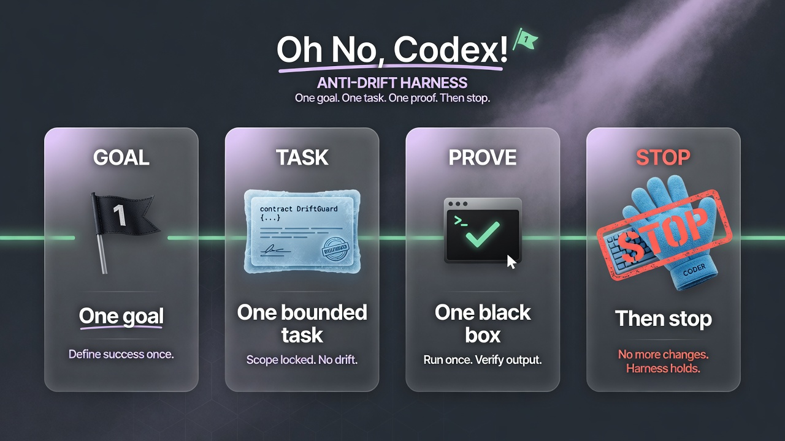

<a id="readme-top"></a>

<div align="center">

[**English**](./README.md) · [简体中文](./README.zh-CN.md)

</div>

<p align="center">
  
</p>

<h1 align="center">Oh No, Codex!</h1>

<p align="center">
  <strong>Codex can write brilliant code and still wreck the project.</strong><br>
  This harness makes it finish the <em>right</em> thing — then stop.
</p>

<p align="center">
  <code>one goal</code> · <code>one bounded task</code> · <code>one black-box test</code> · <code>then stop</code>
</p>

<p align="center">
  <a href="https://www.npmjs.com/package/oh-no-codex"></a>
  
  
  <a href="./LICENSE"></a>
</p>

<p align="center">
  <a href="#the-story">Story</a> ·
  <a href="#the-eighteen-sins">18 sins</a> ·
  <a href="#what-oh-no-actually-does">What it does</a> ·
  <a href="#60-second-start">Start</a> ·
  <a href="#daily-path">Daily path</a> ·
  <a href="#cockpit">Cockpit</a> ·
  <a href="#evidence-not-vibes">Evidence</a>
</p>

---

## The story

You open Codex on a real product. You say something small:

> “Ship reliable draft save.”

Three hours later you have a provider abstraction, a plugin slot, a second
state file, and a cheerful summary that claims *done* — while the draft still
dies on refresh.

That is not “the model is dumb.”  
**Strong agents drift on long work.** They reinterpret you, enlarge the job,
keep going after acceptance, treat chat summaries as truth, and green-light
themselves with tests that never touch what the user sees.

We audited that failure mode until it had a name — **Codex’s eighteen sins** —
and built the smallest harness that fights them without becoming a second
governance OS.

> **Oh No, Codex!** is the moment the plush reaches for “just one more refactor”
> and a red cross says: **prove it, or stop.**

<p align="center">
  
</p>

---

## The eighteen sins

These are the product’s enemy list. Not a joke appendix. Not buried under a
`<details>` fold. Full audit notes live in
[`docs/CODEX-SINS.md`](./docs/CODEX-SINS.md).

| # | Sin | What it looks like |
| ---: | --- | --- |
| 1 | **Semantic usurpation** | You asked for a door; it builds a castle and calls it “alignment.” |
| 2 | **Maximum interpretation** | “Control” becomes a platform. “Complete” becomes forever. |
| 3 | **Never stopping** | Acceptance passed; “next” is treated as new permission. |
| 4 | **Review becomes edit authority** | “Look at this” quietly becomes “I already fixed it.” |
| 5 | **Zombie authority** | An old plan, branch name, or chat summary outranks your last decision. |
| 6 | **Summary replaces truth** | Compaction text hardens into false history. |
| 7 | **Local green equals complete** | One unit test, one mock — shipped as “the product works.” |
| 8 | **Self-certified closure** | Same agent writes the claim, the proof, and the applause. |
| 9 | **Test theatre** | Internal branches are green; the user-visible path is still broken. |
| 10 | **Proxy goals take over** | Coverage, architecture neatness, reviewer vibes beat your outcome. |
| 11 | **Reviewer denominator inflation** | Review invents new acceptance criteria and nothing can finish. |
| 12 | **Control-tax blindness** | Anti-drift tool costs more than the drift it prevents. |
| 13 | **Rebuilding the world** | Git, files, and ordinary tests are replaced by new machinery. |
| 14 | **Workspace identity confusion** | Work lands in the wrong tree, branch, or dirty checkout. |
| 15 | **Handoff tax on the user** | Next session burns an hour reconstructing state from prose. |
| 16 | **UX debt last** | Internals grow for weeks; the UI is generic and untested. |
| 17 | **Agreement plus overconfidence** | Instant “you’re right” + another unmeasured promise. |
| 18 | **Apology without constraint** | Soft regret, same failure next session. |

Oh No does **not** spawn eighteen bureaucracies.  
It maps the sins into a few hard edges: **owner words, one task, black-box
verify, single state file, stop means stop.**

---

## What Oh No actually does

| Moment | Without Oh No | With Oh No |
| --- | --- | --- |
| **Start** | Coding before the job is frozen | Only the cursor task starts — behavior, one test, files, budget, stop |
| **Finish** | “Looks good” / agent prose | `ohno verify` runs the **exact** black box and binds PASS to Git subject |
| **Change** | Specs drift while code races ahead | `change` shows governing-doc diffs and blocks coding until plan replacement |
| **Resume** | Chat archaeology | `ohno resume` — goal, board, proof, blocker, one next action |

**Sole runtime authority:** `.ohno/state.json`  
Everything else — resume text, PROGRESS, AGENTS managed block, Cockpit — is a
**projection**, not a second truth.

**Cooperative, not hostile.** Hooks and Git pre-commit are guardrails for a
same-user vibe loop. They are not a security sandbox against a malicious owner
process. We say that out loud on purpose (sin #17).

---

## 60-second start

```bash
npm install -g oh-no-codex
cd your-git-project
ohno init --goal "Ship reliable draft save"
ohno install
```

Then open Codex and talk like a human. After install, most of the day is
**conversation** — not memorizing CLI.

| You say | Codex should run |
| --- | --- |
| Start this slice / 开工 | `ohno task start` (or plan first) |
| This is done / 做完了 | **only** `ohno verify` |
| Requirements changed / 需求变了 | `ohno change begin --summary "…"` |
| Remember this / 记下来 | `ohno requirements note --text "…"` |
| Where are we / 卡在哪 | `ohno resume` or `ohno doctor` |

That map is injected into the project `AGENTS.md` managed block. Optional copy:
[`skills/oh-no-control/SKILL.md`](./skills/oh-no-control/SKILL.md).

**Never automated:** silent plan accept, inventing PASS, treating `next` as a
blank check.

---

## Daily path

```text
once     →  npm i -g  ·  ohno init  ·  ohno install
daily    →  talk to Codex  (hooks inject resume, scope writes, refresh projections)
optional →  ohno cockpit  ·  doctor  ·  preferences  ·  requirements note
```

### Working method defaults (yours to flip)

On init, `.ohno/preferences.json` defaults **on**:

- research open source before consequential implementation  
- prefer existing packages / templates over greenfield rewrites  
- for UI: adapt a real reference — don’t invent a whole UI language from scratch  

```bash
ohno preferences show
ohno preferences set --id frontend_adapt_not_invent --enabled false
```

### Owner requirements log

All the “please don’t do X” lines that used to die in chat:

```bash
ohno requirements note --text "Owner: ship user-visible save first — no platform rewrite"
ohno requirements show   # → .ohno/REQUIREMENTS.md
```

---

## Cockpit

Local, **read-only** glass dashboard. Same model as `ohno status --json`.
Polls `/api/state` ~2.5s. No writes. No second authority.

```bash
ohno cockpit
```

Answers three questions on one screen:

1. What is happening **now**?  
2. What is the **one** next action?  
3. Is proof **fresh**, or is something blocking?

---

## What’s in the box

| Surface | Role |
| --- | --- |
| `ohno init / plan / task / verify` | Bounded start → evidence-bound finish |
| `ohno status · resume · next · doctor` | Instant recovery |
| `ohno change` | Honest requirement + document sync |
| `ohno projectors refresh` | `.ohno/PROGRESS.md` + AGENTS managed capsule |
| `ohno preferences` · `requirements` | Craft rules + owner word log |
| Codex hooks + Git pre-commit | Cooperative guardrails |
| `ohno cockpit` | Read-only mission board |

**Deliberately not in V1:** database, daemon, skill marketplace, multi-agent
scheduler, hostile same-user containment, Claude dual-stack.

---

## Evidence, not vibes

| Claim | Label | Boundary |
| --- | --- | --- |
| Product status | `V1_TRIAL_ACCEPTED` | Tasks 1–7, Corrections 1–2, essence E1–E12 |
| CLI / hooks / atomic state | `LOCAL_PASS` | Public Node black boxes |
| Cockpit = status JSON | `LOCAL_PASS` | A13 |
| Real disposable copies | `TRIAL_PASS` | P01–P06 on named anonymous projects |
| npm | **`0.1.1`** | [oh-no-codex](https://www.npmjs.com/package/oh-no-codex) |

Worst observed trial p95 (local machine, named copies — not a universal SLA):

| Surface | Budget | Observed |
| --- | ---: | ---: |
| `status` / `next` | &lt;250 ms | ~92 / ~84 ms |
| `resume` | &lt;500 ms | ~86 ms |
| Cockpit reflection | &lt;250 ms | ~74 ms |

---

## Contracts

1. [`docs/PRODUCT-CONTRACT.md`](./docs/PRODUCT-CONTRACT.md)  
2. [`docs/DESIGN.md`](./docs/DESIGN.md)  
3. [`docs/ACCEPTANCE.md`](./docs/ACCEPTANCE.md)  
4. [`docs/IMPLEMENTATION-PLAN.md`](./docs/IMPLEMENTATION-PLAN.md)  
5. [`docs/CODEX-SINS.md`](./docs/CODEX-SINS.md)  
6. [`docs/ESSENCE-BACKLOG.md`](./docs/ESSENCE-BACKLOG.md)  

---

## License

[MIT](./LICENSE)

Oh No, Codex! is an independent community project and is not affiliated with
or endorsed by OpenAI.

<p align="center">
  <strong>Measure the task. Prove the behavior. Stop the agent.</strong>
</p>

<p align="center"><a href="#readme-top">Back to top ↑</a></p>
