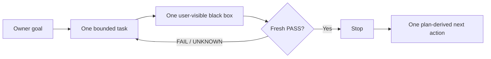

<a id="readme-top"></a>

<p align="center">
  <strong>English</strong>
  ·
  <a href="./README.zh-CN.md">简体中文</a>
</p>

<p align="center">
  
</p>

<h1 align="center">Oh No, Codex!</h1>

<p align="center">
  <strong>A fast, local anti-drift harness for Codex vibe coding.</strong>
</p>

<p align="center">
  One goal. One bounded task. One black-box test. Then stop.
</p>

<p align="center">
  <a href="https://github.com/t01089572455/oh-no-codex/blob/main/docs/IMPLEMENTATION-PLAN.md">
    
  </a>
  
  
  <a href="./LICENSE">
    
  </a>
</p>

<p align="center">
  <a href="#why">Why</a>
  ·
  <a href="#the-four-loops">Four loops</a>
  ·
  <a href="#oh-no-cockpit">Cockpit</a>
  ·
  <a href="#the-eighteen-sins">18 sins</a>
  ·
  <a href="#project-contracts">Docs</a>
</p>

> [!IMPORTANT]
> **V1 remains `V1_CHANGES_REQUIRED`.** The CLI loops, cooperative hooks, Git
> guard, and read-only Cockpit pass local public black boxes; three disposable
> real-project copies pass P01–P05. Required in-app Browser acceptance A14 and
> P06 could not run, so the project does not claim V1 trial acceptance. No npm
> package has been published or released.

## Why

Codex can write good code and still let a project drift:

- a small request quietly becomes a new architecture;
- coding starts before the expected user behavior is clear;
- internal tests pass while the user-visible behavior remains broken;
- a requirement changes, but the governing documents do not;
- “next” is mistaken for permission to keep working;
- the next session spends an hour reconstructing the truth from chat.

Oh No, Codex! puts a lightweight harness around each task boundary. Before a
supported write, it asks for one bounded task and one minimal, user-visible
black-box test. At the finish line, fresh evidence—not agent prose—decides
whether the task stops.

It is a **cooperative project harness** for local Codex work. It is not an AI
security sandbox, an enterprise governance platform, or a promise that a
hostile process cannot bypass its owner.

## The four loops



The next action is a locator, not fresh authorization.

| Loop | Drift it prevents | Smallest useful behavior |
| --- | --- | --- |
| **Start** | Coding before the task is understood | Activate only the frozen cursor task: expected behavior, one test, allowed files, time budget, and stop condition. |
| **Finish** | “Looks done” completion claims | Run the exact black box and bind PASS to the current task and Git subject. |
| **Change** | Requirements and governing documents diverging | Select required documents from Owner-maintained Truth, show the exact diff, and block coding until review. |
| **Resume** | New sessions rebuilding state from prose | Return the goal, current task, proof, blocker, and one next action from one atomic state file. |

## Thirty-second contract preview

> These commands are implemented from source. No npm release exists.

```bash
# Anchor one project goal
ohno init --goal "Ship reliable draft persistence"

# Propose a reviewed ordered plan stored in .ohno/review-plan.json
ohno plan propose --file .ohno/review-plan.json

# Accept only the exact values printed by the proposal
ohno plan accept --revision <PLAN_REVISION> --diff <DIFF_DIGEST>

# Start only ordered_tasks[cursor]; callers cannot override its contract
ohno task start

# Let evidence decide, then recover state in any new session
ohno verify
ohno resume
ohno next
```

## CLI core, thin hooks

The CLI owns the state and decisions. Hooks only bring those decisions to the
moment Codex is about to act:

| Surface | V1 job |
| --- | --- |
| `SessionStart` / `PostCompact` | Inject the goal, current task, proof, blocker, and one next action. |
| `PreToolUse` | Block supported writes when the task contract is missing or the path is outside the declared scope. |
| `Stop` | On the exact `OHNO_COMPLETE:<task-id>` marker, keep the task open unless proof is fresh and document sync is clean. Missing or paraphrased markers are not completion signals. |
| Git `pre-commit` | Reject an out-of-scope or unverified commit. |

Hooks are guardrails around cooperative Codex use—not an unbreakable security
boundary.

## One authority, several views

```text
ohno CLI -- atomic replace --> .ohno/state.json
                                  |-- status / resume / next
                                  |-- thin Codex hooks
                                  |-- Git pre-commit guard
                                  `-- read-only Cockpit

.ohno/truth.json -------------> named governing documents
```

- `.ohno/state.json` is the sole current runtime authority.
- `.ohno/truth.json` is the Owner-maintained document applicability list.
- Hooks, receipts, terminal output, and Cockpit are projections—not competing
  sources of truth.
- Normal read paths stay bounded: no whole-repository document scan and no
  full test suite.

## Small by design

V1 has one Node.js package, one `ohno` executable, one atomic state file, one
Truth list, thin project hooks, one Git hook, and one local read-only Cockpit.

It deliberately has no database, daemon, hosted service, policy language,
plugin platform, provider framework, or multi-agent scheduler. A new
abstraction earns its place only when a failing public black-box test needs it.

## Oh No Cockpit

The Cockpit is implemented as a local, GET-only projection of the same read
model as `ohno status --json`; it owns no state, cache, database, or write
route. Its largest area answers two questions:

1. **What is happening now?**
2. **What is the one next action?**

> [!NOTE]
> **Functional `LOCAL_PASS`, browser acceptance unavailable.** The running
> HTTP surface passes A13, but the required in-app Browser rejected the
> authorized loopback URL. This conceptual panel is therefore not presented as
> an A14 screenshot, and P06 remains `NOT_MEASURED`.

```bash
ohno cockpit
```

```text
+-- OH NO COCKPIT -------------------------- LOCAL / READ ONLY --+
| NOW                                                             |
| draft-persistence                                  ACTIVE  42m   |
| A saved draft survives page reload                              |
|                                                                  |
| PROOF                         | DRIFT                             |
| UNKNOWN                       | CLEAN                             |
| npm test -- draft-persistence | governing documents aligned      |
|                                                                  |
| NEXT                                                             |
| Run the exact black-box test                                     |
+------------------------------------------------------------------+
```

The locked palette follows product meaning:

| Color | Role |
| --- | --- |
| Warm cream `#FFF1CE` | instrument surface |
| Charcoal `#202624` | structure and type |
| Coral red `#FF4B35` | blocked or stale |
| Amber `#F4AA2A` | active work |
| Mint `#74D6B1` | fresh PASS only |

## The eighteen sins

The original shorthand was “Codex’s ten sins.” The audited patterns separated
cleanly into eighteen. Oh No, Codex! turns them into constraints, tests, or
explicit non-goals—not eighteen new subsystems.

<details>
<summary><strong>Open all 18</strong></summary>

| # | Sin | Product correction |
| ---: | --- | --- |
| 1 | **Semantic usurpation** | Preserve the Owner’s words; ambiguity selects the smallest satisfying behavior. |
| 2 | **Maximum interpretation** | No subsystem or abstraction without a current public RED. |
| 3 | **Never stopping** | Acceptance ends the task; `next` is not permission. |
| 4 | **Review becomes edit authority** | Review is read-only unless fixes are explicitly authorized. |
| 5 | **Zombie authority** | Current canonical state outranks old plans and summaries. |
| 6 | **Summary replaces truth** | Resume is a bounded projection, never a new authority. |
| 7 | **Local green equals complete** | Every claim names its exact evidence scope. |
| 8 | **Self-certified closure** | Exact commands and subject-bound receipts outrank agent prose. |
| 9 | **Test theatre** | Every task owns one minimal user-visible black box. |
| 10 | **Proxy goals take over** | Keep one Owner goal and one active bounded task visible. |
| 11 | **Reviewer denominator inflation** | Review against frozen acceptance; extra ideas remain proposals. |
| 12 | **Control-tax blindness** | Latency, capsule size, and no-full-scan paths are acceptance rows. |
| 13 | **Rebuilding the world** | Prefer Git, files, and ordinary tests before new machinery. |
| 14 | **Workspace identity confusion** | Handoffs name path, branch, commit, tree, and dirty state. |
| 15 | **Handoff tax on the user** | One `resume` command returns the operational capsule. |
| 16 | **UX debt last** | Freeze the Cockpit design before code; accept it in the browser. |
| 17 | **Agreement plus overconfidence** | Use honest capability labels and measured evidence. |
| 18 | **Apology without constraint** | Every confirmed incident becomes a rule, regression, or non-goal. |

Read the privacy-scrubbed audit and evidence boundary in
[`docs/CODEX-SINS.md`](https://github.com/t01089572455/oh-no-codex/blob/main/docs/CODEX-SINS.md).

</details>

## Evidence, not promises

Capability labels name the evidence actually held by this repository:

| Capability | Status | Evidence boundary |
| --- | --- | --- |
| CLI state, plan, verify, resume, change, hooks, and atomic-write behavior | `LOCAL_PASS` | Public Node black boxes A01–A12, A15, and A16 |
| Read-only Cockpit projection | `LOCAL_PASS` | A13 HTTP equality with `status --json`; no browser claim |
| Three copied-project loops and P01–P05 | `TRIAL_PASS` | Anonymous TypeScript CLI, React/Vite Web, and Python OCR source copies |
| Desktop/narrow visual and accessibility acceptance | `UNAVAILABLE` | A14 could not run in the required in-app Browser |
| State-to-Cockpit browser reflection | `UNAVAILABLE` | P06 is `NOT_MEASURED`; HTTP timing is not substituted |
| npm publication or release | `UNAVAILABLE` | Not authorized and not performed |

The three-copy measurements use one untimed warm-up and 30 raw samples per
command per copy. Worst observed p95 values were:

| Surface | Frozen budget | Worst observed | Result |
| --- | ---: | ---: | --- |
| `ohno status` | `<250 ms` | `92.249 ms` | `TRIAL_PASS` |
| `ohno next` | `<250 ms` | `84.213 ms` | `TRIAL_PASS` |
| `ohno resume` | `<500 ms` | `85.938 ms` | `TRIAL_PASS` |
| Largest accepted resume capsule | `<4096 bytes` | `3194 bytes` | `TRIAL_PASS` |
| Task-start harness overhead | `<2000 ms` | `97.667 ms` | `TRIAL_PASS` |
| State-to-Cockpit browser reflection | `<250 ms` | `NOT_MEASURED` | `UNAVAILABLE` |

These are local trial results for the named anonymous copies and machine, not
a universal speed or production-readiness guarantee.

## Project contracts

Public product truth lives in a small set of documents:

1. [Product contract](https://github.com/t01089572455/oh-no-codex/blob/main/docs/PRODUCT-CONTRACT.md)
2. [V1 design](https://github.com/t01089572455/oh-no-codex/blob/main/docs/DESIGN.md)
3. [Acceptance contract](https://github.com/t01089572455/oh-no-codex/blob/main/docs/ACCEPTANCE.md)
4. [Implementation ledger](https://github.com/t01089572455/oh-no-codex/blob/main/docs/IMPLEMENTATION-PLAN.md)
5. [The Codex sins](https://github.com/t01089572455/oh-no-codex/blob/main/docs/CODEX-SINS.md)

## License

[MIT](./LICENSE)

Oh No, Codex! is an independent community project and is not affiliated with
or endorsed by OpenAI.

<p align="center">
  <strong>Measure the task. Prove the behavior. Stop the agent.</strong>
</p>

<p align="center"><a href="#readme-top">Back to top ↑</a></p>
