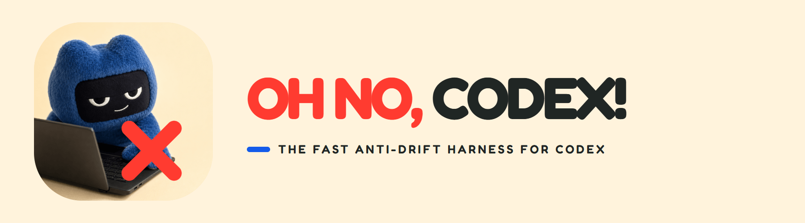
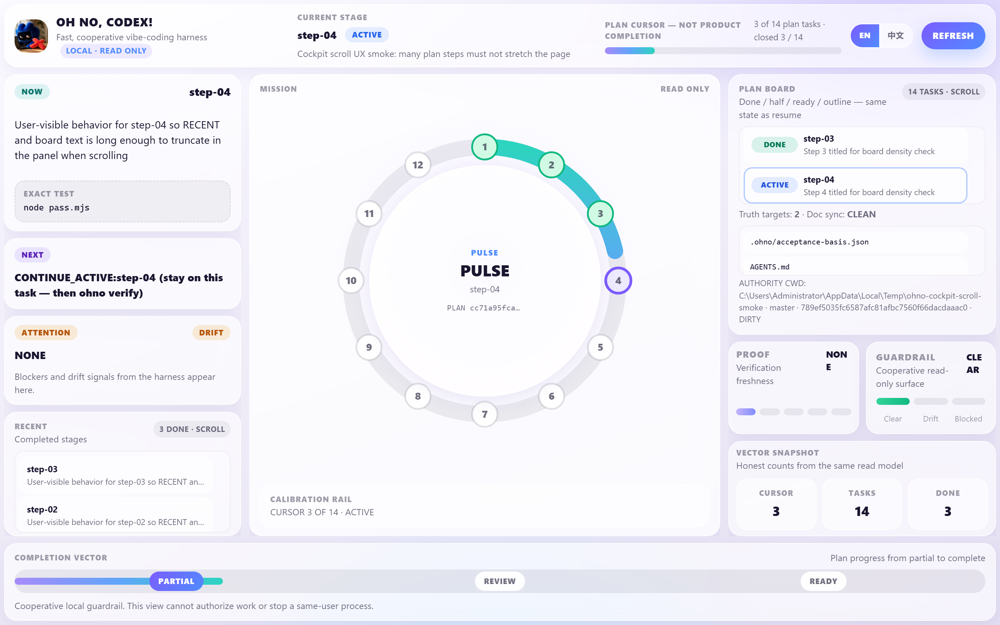

<a id="readme-top"></a>

<div align="center">

[**English**](./README.md) · [简体中文](./README.zh-CN.md)

</div>

<br>

<p align="center">
  
</p>

<p align="center">
  <strong>A fast, local anti-drift harness for Codex vibe coding.</strong>
</p>

<p align="center">
  <a href="https://www.npmjs.com/package/oh-no-codex"></a>
  
  
  
  <a href="./LICENSE"></a>
</p>

<p align="center">
  <a href="#why-oh-no">Why</a> ·
  <a href="#eighteen-sins">The Eighteen Sins</a> ·
  <a href="#cockpit">Cockpit</a> ·
  <a href="#install-use">Install & use</a> ·
  <a href="#how-control-works">How control works</a> ·
  <a href="#limits-evidence">Limits & evidence</a>
</p>

---

<a id="why-oh-no"></a>

## Why Oh No?

Codex can write good code and still take a project in the wrong direction. It
may broaden the request, keep working after success, trust stale plans, or make
the next session reconstruct everything from chat.

Oh No, Codex! adds a small local harness around that workflow. It keeps the
Owner’s words, one bounded task, one exact black-box test, fresh evidence, and
one next action readable across sessions.

Those recurring failures are documented in a public incident audit called
[**The Eighteen Sins of Codex**](./docs/CODEX-SINS.md).

---

<a id="eighteen-sins"></a>

## The Eighteen Sins of Codex

The name is deliberate. These are 18 distinct, privacy-scrubbed failure
patterns—not a claim that every Codex run fails.

| # | Pattern | What you see |
| ---: | --- | --- |
| 1 | Semantic usurpation | A narrow request quietly becomes a larger product or architecture |
| 2 | Maximum interpretation | Words such as “control” or “robust” are interpreted at the highest imaginable level |
| 3 | Never stopping | Acceptance already passed, but the Agent keeps editing or opens another phase |
| 4 | Review as edit rights | An inspect or audit request turns into unapproved edits and commits |
| 5 | Zombie authority | An old plan or summary overrides the Owner’s latest decision |
| 6 | Summary as truth | A compacted handoff hardens omissions into false project history |
| 7 | Local green = complete | One unit or mocked path becomes a claim that the whole feature is done |
| 8 | Self-certified closure | The same Agent defines success, implements it, and cites itself as proof |
| 9 | Test theatre | Tests prove internals while the user-visible path remains broken or untested |
| 10 | Proxy goals | Coverage, architecture neatness, or reviewer taste outranks the Owner’s outcome |
| 11 | Reviewer inflation | Review adds criteria that were never frozen, so the task cannot finish |
| 12 | Control-tax blindness | The guardrail becomes slower and heavier than the drift it prevents |
| 13 | Rebuilding the world | Git, tests, and simple files are replaced by a new platform before value ships |
| 14 | Workspace confusion | Work lands in the wrong branch, worktree, HEAD, or dirty checkout |
| 15 | Handoff tax | Every new session must reconstruct the project from chat archaeology |
| 16 | UX last | Internal machinery grows while the user experience stays generic or untested |
| 17 | Agree + overclaim | An apology is followed by another unmeasured promise |
| 18 | Apology without constraint | The failure is explained, but no test or working rule changes |

Read the complete audit and evidence boundary:
[`docs/CODEX-SINS.md`](./docs/CODEX-SINS.md).

---

<a id="cockpit"></a>

## Cockpit

<p align="center">
  
</p>

<p align="center">
  <sub>Real local layout-demo capture. Cursor 3/14 means plan progress, not product completion.</sub>
</p>

The Cockpit is a read-only view of the same project state as the CLI. It shows
the current task and exact test, proof freshness, blockers, plan position, and
one next action without creating a second source of truth.

---

<a id="install-use"></a>

## Install and use

Requires Node.js **22.20 or newer**. Current release: **`0.2.0`**.

### New or empty repository

```bash
npm install -g oh-no-codex

cd your-git-repo
ohno init
ohno install
ohno doctor
```

`ohno install` adds the project hooks and installs the `oh-no-*` Codex skills.
Start a new Codex session after installation so skill discovery reloads.

Skills can also be refreshed separately:

```bash
ohno skill install
ohno skill status
```

### Existing or half-built repository

Oh No can be added beside existing code, but it does not automatically infer
old truth, completed work, or the correct plan from Git history.

1. Initialize with the **current stage** goal—not the entire historical vision.
2. Let the trusted prompt hook preserve new Owner words in `.ohno/OWNER-INPUTS.md`, then consolidate what is already true, what must ship now, non-goals, and hard constraints in `.ohno/REQUIREMENTS.md`.
3. Review which PRD, design, acceptance, plan, README, and Agent files are current governing documents; keep one winning set in Truth.
4. Plan only work that still needs a user-visible black-box proof. Do not invent historical PASS receipts.
5. Accept the reviewed plan; Codex then starts the cursor, works inside its boundary, repairs proof, verifies, and advances automatically.

```bash
ohno init
ohno install
ohno doctor
ohno requirements note --text "What is already true in this repository"
ohno requirements note --text "What this stage must still deliver"
```

If governing requirements change after setup, use `ohno change`; do not edit
`.ohno/state.json` by hand or silently replace the plan.

### The daily loop

Normally you can tell Codex, “Draft a bounded plan and finish it.” The installed
`oh-no-plan` skill resolves material ambiguity during PREPARE and reviews the
plan. Once accepted, Codex runs the deterministic loop without asking again at
ordinary task boundaries. The primitives remain available directly:

```bash
ohno                    # one-screen harness brief
ohno next | ohno task start | ohno verify
# task shape: id + expect + test + scope (other fields default)
# plan propose/accept for a short vertical slice (advanced)
```

- A zero-exit exact test with unchanged scoped files creates a fresh PASS and
  advances once.
- FAIL, timeout, unreadable state, or test-time mutation leaves the task active.
- `next` locates the current plan position; it does not authorize the Agent to
  invent more work. The already accepted plan authorizes Codex to execute that
  canonical action automatically.
- Oh No stops only at `PROJECT_COMPLETE` or a real task-bound `NEEDS_INPUT`
  condition such as a missing secret/device/business fact, unapproved paid or
  destructive action, absent honest acceptance path, or state/platform blocker.
  Supplying that input resumes the same accepted workflow.

### Talk naturally in Codex

| What you say | Skill / command |
| --- | --- |
| “Consolidate this current requirement” | `oh-no-requirements` → `ohno requirements note` |
| “Draft or review the bounded plan” | `oh-no-plan` |
| “Start the current task” | `oh-no-task` → `ohno task start` (automatic after plan acceptance) |
| “I think this task is done” | `oh-no-verify` → `ohno verify` (automatic proof loop) |
| “Where are we?” | `oh-no-resume` / `ohno status` |
| “The requirements changed” | `oh-no-change` |
| “Open the board” | `oh-no-cockpit` → `ohno cockpit` |
| “Check the installation” | `oh-no-doctor` |

Trusted `UserPromptSubmit` hooks append exact new prompts to the local/private
`.ohno/OWNER-INPUTS.md`; `.ohno/REQUIREMENTS.md` holds Codex's current
interpretation and visible history with material input ids. Oh No cannot
reliably decide which prompt is the final decision, recover older prompts, or
capture another client or a bypassed/untrusted hook.

### Open the Cockpit

```bash
ohno cockpit                       # start on a free local port
ohno cockpit --port 13521          # optional fixed port
ohno cockpit --replace             # replace this repo's running Cockpit
ohno cockpit stop
```

Each repository or worktree has its own `.ohno/` state and Cockpit.

### Windows

Put the global npm bin directory on `PATH` and run `ohno` or `ohno.cmd` in a
terminal. Do not double-click `dist\cli.js`; Windows Script Host cannot run
that ESM entry.

---

<a id="how-control-works"></a>

## How Oh No controls the workflow

After installation, control comes from project files and explicit checkpoints,
not a larger prompt:

1. **Owner words and interpretations stay distinct.** Trusted exact prompts append to local/private `.ohno/OWNER-INPUTS.md`; Codex consolidates current meaning and visible history in `.ohno/REQUIREMENTS.md`.
2. **One task is frozen.** The current plan item fixes expected behavior, one black-box test, allowed files, budget, and stop condition.
3. **Supported writes are guarded.** Codex hooks and Git pre-commit reject no-task, pending-document, and parseable out-of-scope mutations.
4. **Evidence advances the plan.** `ohno verify` runs the frozen command; FAIL / UNKNOWN stay active, while fresh PASS advances exactly once.
5. **Every surface reads the same state.** `status`, `resume`, `next`, hooks, and Cockpit agree on the project position.
6. **Accepted plans run automatically.** The Stop hook returns an `OHNO_AUTO_CONTINUE` prompt with the canonical next action; Codex—not the hook—starts, repairs, verifies, and advances.
7. **Requirement changes stop coding.** `ohno change` uses the Owner-maintained Truth list and requires a reviewed governing-document diff plus replacement plan; clear new Owner intent does not need a second conversational confirmation.

### Authority

```text
ohno CLI  ──atomic replace──►  .ohno/state.json   (sole runtime authority)
                                    │
                                    ├─ status / resume / next
                                    ├─ Codex hooks + Git pre-commit
                                    └─ GET /api/state  →  Cockpit (read-only)

.ohno/truth.json  →  which Owner documents apply on requirement change
```

| Artifact | Role |
| --- | --- |
| `.ohno/state.json` | Current goal, plan, cursor, active contract, proof, and next action |
| `.ohno/OWNER-INPUTS.md` | Local/private append-only exact prompts from the trusted hook; evidence, not final-requirement classification |
| `.ohno/REQUIREMENTS.md` | Codex's current interpretation and visible supersession history, with material Owner-input ids |
| `.ohno/truth.json` | Owner-maintained governing-document applicability list |
| PASS receipt | Verification provenance and freshness evidence; not another current authority |
| `PROGRESS.md` / resume text / Cockpit | Read-only projections of current state |
| `.ohno/cockpit.runtime.json` | Local Cockpit pid / URL pointer only |

Cooperative hooks inject the resume capsule and deny some out-of-scope writes.
A same-user process can still bypass them; that is an explicit non-goal.

---

<a id="limits-evidence"></a>

## Honest limits and evidence

Oh No is a cooperative local harness, not an autonomous agent OS or security
boundary. It does not prevent `--no-verify`, direct same-user file writes,
unsupported hosted tools, or an Agent that deliberately ignores every rule.

It does not judge prose by NLP, reconstruct a half-built product automatically,
or guarantee universal correctness and speed. Cockpit progress is
`cursor / task_count`, never a product-completion percentage.
Automatic execution removes Oh No's own conversational confirmation ceremony;
it cannot suppress Codex or operating-system approval prompts.

| Public fact | Current evidence |
| --- | --- |
| Package | [`oh-no-codex@0.2.0`](https://www.npmjs.com/package/oh-no-codex) is published |
| Core loop | `ANTI_DRIFT_CORE_WORKS` with local public black-box coverage |
| Harness surface | `0.2.0`: four fences (short plan, id+expect+test+scope, scope hook, hard black box); short `OHNO_CONTINUE` cards; raised authoring limits; optional acceptance_source |
| Real-project trial | The current local Correction 5 package subject earned same-batch LIVE `TRIAL_PASS` on three named disposable copies (`live-20260805T064039Z-834bc92`); this is not a universal speed or published-package claim |
| Cockpit | Read-only equality with the CLI state plus browser and local reflection checks |

Exact contracts and evidence:

- [Product contract](./docs/PRODUCT-CONTRACT.md)
- [Design](./docs/DESIGN.md)
- [Acceptance contract](./docs/ACCEPTANCE.md)
- [Implementation ledger](./docs/IMPLEMENTATION-PLAN.md)
- [Cockpit design contract](./docs/COCKPIT-DESIGN-CONTRACT.md)
- [Publish procedure](./docs/PUBLISH.md)

---

<p align="center">
  <sub>MIT · Independent community project · Not affiliated with OpenAI</sub>
</p>

<p align="center"><a href="#readme-top">↑ top</a></p>
