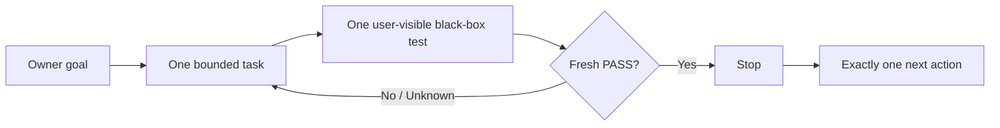

<p align="center">
  <strong>English</strong>
  ·
  <a href="./README.zh-CN.md">简体中文</a>
</p>

<h1 align="center">Oh No, Codex!</h1>

<p align="center">
  <strong>A fast anti-drift harness for Codex vibe coding.</strong>
</p>

<p align="center">
  Born from Codex's sins. Built to stop the next one.
</p>

<p align="center">
  <a href="./docs/PRODUCT-CONTRACT.md">
    
  </a>
  
  
  <a href="./LICENSE">
    
  </a>
</p>

<p align="center">
  <a href="#why-oh-no-codex">Why</a>
  ·
  <a href="#the-four-loops">Four loops</a>
  ·
  <a href="#caliper-cockpit">Cockpit</a>
  ·
  <a href="#the-codex-sins">Codex sins</a>
  ·
  <a href="#project-contracts">Docs</a>
</p>

> [!IMPORTANT]
> **V1 is under active implementation.** The product contract is frozen, but
> the package is not released. Commands and screenshots in this README are
> contract previews until their linked acceptance rows are earned.

## Why Oh No, Codex?

Codex can write good code and still let a project drift:

- a small request quietly becomes a new architecture;
- an internal green test misses the user-visible behavior;
- “what comes next” is mistaken for permission to continue;
- a requirement changes, but the governing documents do not;
- the next session spends its first hour reconstructing the truth.

Oh No, Codex! puts a lightweight caliper around each task boundary. Before
mutation, it asks for one bounded task and one minimal black-box test. At the
finish line, fresh evidence—not agent prose—decides whether the task stops.

It is a **cooperative project harness**, not an AI security sandbox or an
enterprise governance platform.

## The tiny contract



Every active task freezes:

- the expected user-visible behavior;
- one exact minimal black-box command;
- allowed file globs and a time budget;
- an explicit stop condition;
- exactly one proposed next action.

A failed or unknown test keeps the task active. A fresh PASS closes it. A
relevant change makes that proof stale.

## The four loops

| Loop | What it prevents | What the harness does |
| --- | --- | --- |
| **Start** | Coding before the task is understood | Freezes behavior, test, files, budget, stop condition, and one next action. |
| **Finish** | “Looks done” completion claims | Runs the exact black box and binds PASS to the task, HEAD, and allowed-file digest. |
| **Change** | Requirements and governing docs drifting apart | Selects required documents from Owner-maintained Truth, shows the exact diff, and blocks coding until review. |
| **Resume** | New sessions rebuilding state from chat history | Returns the goal, current task, proof freshness, blocker, and one next action from one atomic state file. |

## A thirty-second workflow

> The interface below is the frozen V1 contract. It is not an installation
> claim while the package remains unreleased.

```bash
# 1. Anchor the project goal
ohno init --goal "Ship reliable draft persistence"

# 2. Start one bounded task
ohno task start \
  --id "draft-persistence" \
  --expect "A saved draft survives page reload" \
  --test "npm test -- draft-persistence" \
  --stop "Stop when that black-box test passes" \
  --files "src/drafts/**,test/draft-persistence.test.*" \
  --minutes 60 \
  --next "Add draft deletion"

# 3. Let evidence decide
ohno verify

# 4. Recover the exact operational state in a new session
ohno resume
ohno next
```

## One authority, several useful views

```text
Codex
  │
  ▼
ohno CLI ───── atomic replace ─────▶ .ohno/state.json
  │                                      │
  │                                      ├── status / resume / next
  │                                      ├── Codex lifecycle hooks
  │                                      ├── Git pre-commit
  │                                      └── read-only Cockpit
  │
  └──── governing documents ◀──── .ohno/truth.json
```

- `.ohno/state.json` is the sole current runtime authority.
- `.ohno/truth.json` is the Owner-maintained document applicability list.
- Hooks, terminal output, receipts, and Cockpit are projections—not competing
  sources of truth.
- Normal status paths read bounded state; they do not scan the repository or
  run the full test suite.

## Caliper Cockpit

The Cockpit is designed as a **precision caliper crossed with a warning
beacon**, not a generic SaaS dashboard. The dominant instrument answers:
**What is happening now, and what is the one next action?** Smaller instruments
show proof freshness and document drift.

> [!NOTE]
> **Concept preview—UI not yet implemented.** This reserved panel will be
> replaced by real desktop and narrow-viewport screenshots only after the
> running Cockpit passes browser-based visual, responsive, accessibility, and
> functional acceptance.

```text
┌─ OH NO / CALIPER COCKPIT ───────────────────── LOCAL · READ ONLY ─┐
│                                                                  │
│  NOW                                                             │
│  DRAFT-PERSISTENCE                               ACTIVE · 42 min  │
│  A saved draft survives page reload                              │
│  ──────────────────────────────────────────────────────────────  │
│                                                                  │
│  PROOF                         DRIFT                              │
│  ○ UNKNOWN                     ● CLEAN                            │
│  npm test -- draft-persistence  governing documents aligned      │
│                                                                  │
│  NEXT                                                            │
│  Run the exact black-box test                                    │
│                                                                  │
└──────────────────────────────────────────────────────────────────┘
```

The visual contract calls for warm instrument-paper surfaces, near-black
typography, signal red for blocked or stale states, calibrated amber for
active work, and restrained mint only for fresh PASS. It remains read-only and
never creates a second state store.

## Thin Codex and Git guardrails

Project-local Codex hooks are designed to stay fast and honest:

| Hook | Behavior |
| --- | --- |
| `SessionStart` | Inject the bounded resume capsule. |
| `PostCompact` | Re-inject canonical state after context compaction. |
| `PreToolUse` | Deny supported mutation paths when no task is active, document sync is pending, or a known target is out of scope. |
| `Stop` | Continue when the explicit completion marker lacks fresh exact proof. |
| Git `pre-commit` | Reject stale proof or staged paths outside the active task. |

These are cooperative guardrails. Unsupported or bypassable paths are reported
as limitations, never mislabeled as hostile-agent containment.

## The Codex sins

The product turns recurring failure patterns into executable constraints,
acceptance checks, or explicit non-goals.

<details>
<summary><strong>Open the full list of 18 sins</strong></summary>

| # | Failure pattern | Product countermeasure |
| ---: | --- | --- |
| 1 | **Semantic usurpation**—the agent decides what the Owner meant. | Preserve the Owner's words; ambiguity cannot silently broaden scope. |
| 2 | **Maximum interpretation**—a small harness becomes a governance OS. | Choose the smallest behavior that satisfies frozen acceptance. |
| 3 | **Never stopping**—a next action becomes fresh authorization. | Acceptance ends the task; next is information, not permission. |
| 4 | **Review becomes edit authority.** | Review stays read-only unless fixes are explicitly authorized. |
| 5 | **Zombie authority**—an old plan overrides the current decision. | Canonical current state outranks summaries and historical plans. |
| 6 | **Summary replaces truth.** | Resume is a projection of atomic state, never a new authority. |
| 7 | **Local green equals complete.** | Every claim names its exact evidence scope. |
| 8 | **Self-certified closure.** | Exact commands and subject-bound receipts outrank agent prose. |
| 9 | **Test theatre**—internals pass while the product fails. | Every task owns a public user-visible black box. |
| 10 | **Proxy goals take over.** | Keep one Owner goal and one bounded active task. |
| 11 | **Reviewer denominator inflation.** | Review against frozen acceptance; extra ideas remain proposals. |
| 12 | **Control-tax blindness.** | Latency and capsule-size budgets are acceptance criteria. |
| 13 | **Rebuilding the world.** | Add no abstraction without a current reproduced need. |
| 14 | **Workspace identity confusion.** | Handoffs name real path, branch, commit, tree, and dirty state. |
| 15 | **Handoff tax on the user.** | `resume` returns one compact operational capsule. |
| 16 | **UX debt last.** | Freeze Cockpit design before code and accept it in the browser. |
| 17 | **Agreement plus overconfidence.** | Use honest capability labels and measured evidence. |
| 18 | **Apology without constraint.** | Convert confirmed failures into executable rules or regressions. |

Read the expanded bilingual record in
[`docs/CODEX-SINS.md`](./docs/CODEX-SINS.md).

</details>

## Deliberately small

V1 has a hard complexity budget:

- one Node.js package and one `ohno` executable;
- one atomic current-state file and one Truth applicability file;
- one project Codex hook configuration and one Git hook;
- one local read-only Cockpit;
- no database, daemon, hosted service, policy language, plugin platform,
  provider framework, or multi-agent scheduler.

No new abstraction earns a place unless a failing public acceptance test
requires it.

## Evidence, not promises

The target budgets must be measured on three disposable real-project copies:

| Surface | V1 target |
| --- | ---: |
| `ohno status` / `ohno next` | local p95 below 250 ms |
| `ohno resume` | local p95 below 500 ms |
| Resume capsule | below 4 KiB |
| Task-start harness overhead | below 2 s, excluding the user's test |
| State-to-Cockpit reflection | local p95 below 250 ms |

Until those trials pass, they are targets—not universal speed claims.

## Project contracts

Public truth lives in these documents:

1. [Product contract](./docs/PRODUCT-CONTRACT.md)
2. [V1 design](./docs/DESIGN.md)
3. [Acceptance contract](./docs/ACCEPTANCE.md)
4. [Implementation ledger](./docs/IMPLEMENTATION-PLAN.md)
5. [The Codex sins](./docs/CODEX-SINS.md)

## License

[MIT](./LICENSE)

<p align="center">
  <strong>One goal. One task. One black box. Then stop.</strong>
</p>
