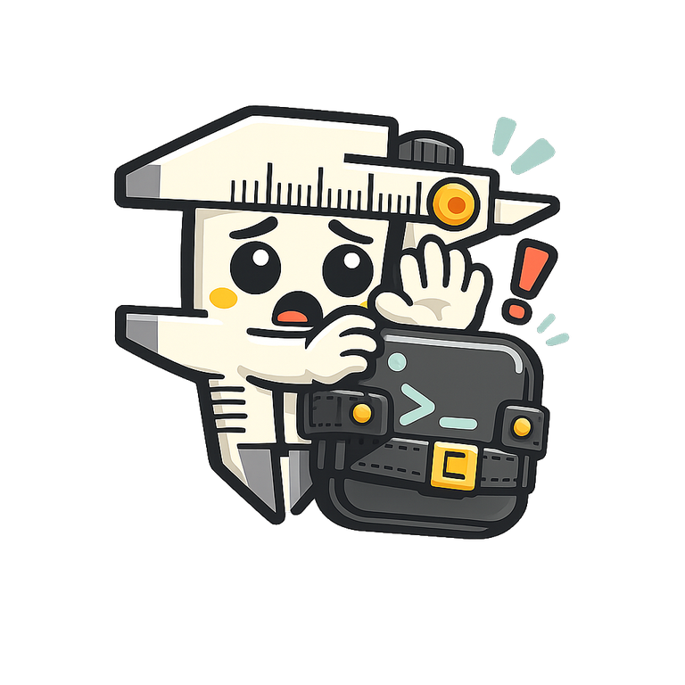
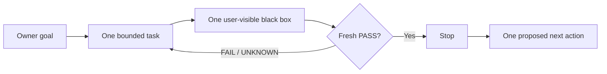
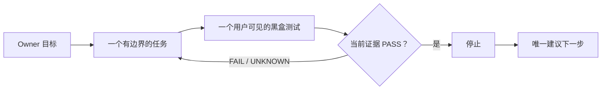

<a id="readme-top"></a>

<p align="center">
  <a href="#english"><strong>English</strong></a>
  ·
  <a href="#zh-cn"><strong>简体中文</strong></a>
</p>

<p align="center">
  
</p>

<h1 align="center">Oh No, Codex!</h1>

<p align="center">
  <strong>One goal. One bounded task. One black box. Then stop.</strong>
</p>

<p align="center">
  Born from Codex's sins. Built to stop the next one.
</p>

<p align="center">
  <a href="./docs/IMPLEMENTATION-PLAN.md">
    
  </a>
  
  
  <a href="./LICENSE">
    
  </a>
</p>

<p align="center">
  <a href="#caliper-cockpit">Cockpit</a>
  ·
  <a href="#the-eighteen-sins">18 sins</a>
  ·
  <a href="#project-contracts">Docs</a>
</p>

> [!IMPORTANT]
> **V1 is being built / V1 正在实现。** No public acceptance row has been
> earned on `main`, and no package has been released. Commands and the Cockpit
> below are contract previews, not availability claims.

---

<a id="english"></a>

## English

### The tiny anti-drift harness

Codex can write good code and still let a project drift:

- a small request quietly becomes a new architecture;
- an internal green test misses the behavior a user can actually see;
- a requirement changes, but the governing documents do not;
- “next” is mistaken for permission to keep working;
- the next session spends an hour reconstructing the truth from chat.

Oh No, Codex! places a lightweight caliper around each task boundary. Before a
supported mutation, it asks for one bounded task and one minimal user-visible
black-box test. At the finish line, fresh evidence—not agent prose—decides
whether the task stops.

It is a **cooperative project harness** for local Codex work. It is not an AI
security sandbox, an enterprise governance platform, or a promise that an
agent cannot bypass its owner.

### The whole product loop



The next action is a locator, not fresh authorization.

| Loop | Drift it prevents | Smallest useful behavior |
| --- | --- | --- |
| **Start** | Coding before the task is understood | Freeze expected behavior, one test, allowed files, time budget, stop condition, and one next action. |
| **Finish** | “Looks done” completion claims | Run the exact black box and bind PASS to the task, Git subject, and allowed-file digest. |
| **Change** | Requirements and governing documents diverging | Select required documents from Owner-maintained Truth, show the exact diff, and block coding until review. |
| **Resume** | New sessions rebuilding state from prose | Return the goal, current task, proof, blocker, and one next action from one atomic state file. |

### Thirty-second contract preview

> The interface is frozen, but it is not released yet.

```bash
# Anchor one project goal
ohno init --goal "Ship reliable draft persistence"

# Start one bounded task
ohno task start \
  --id "draft-persistence" \
  --expect "A saved draft survives page reload" \
  --test "npm test -- draft-persistence" \
  --files "src/drafts/**,test/draft-persistence.test.*" \
  --minutes 60 \
  --stop "Stop when the black-box test passes" \
  --next "Add draft deletion"

# Let evidence decide, then recover state in any new session
ohno verify
ohno resume
ohno next
```

### One authority, several views

```text
ohno CLI -- atomic replace --> .ohno/state.json
                                  |-- status / resume / next
                                  |-- thin Codex hooks
                                  |-- Git pre-commit guard
                                  `-- read-only Cockpit

.ohno/truth.json -------------> named governing documents
```

- `.ohno/state.json` is the sole current runtime authority.
- `.ohno/truth.json` is the Owner-maintained document applicability list.
- Hooks, receipts, terminal output, and Cockpit are projections—not competing
  sources of truth.
- Normal read paths stay bounded: no whole-repository document scan and no
  full test suite.

### Small by design

V1 has one Node.js package, one `ohno` executable, one atomic state file, one
Truth list, thin project hooks, one Git hook, and one local read-only Cockpit.

It deliberately has no database, daemon, hosted service, policy language,
plugin platform, provider framework, or multi-agent scheduler. A new
abstraction earns its place only when a failing public black-box test needs it.

<p align="right"><a href="#readme-top">Back to top ↑</a></p>

---

<a id="zh-cn"></a>

## 简体中文

### 一个很小的防漂移 Harness

Codex 能写出不错的代码，也仍然可能把项目带偏：

- 一个小需求悄悄膨胀成一套新架构；
- 内部测试全绿，但用户真正看到的功能仍然坏着；
- 需求已经变化，规范文档却没有一起更新；
- “下一步是什么”被误解成“可以继续做”；
- 新 Session 先花一个小时从聊天记录里重建现场。

Oh No, Codex! 像游标卡尺一样卡住每个任务边界。开始写入前，先固定一个
有边界的任务和一个最小、用户可见的黑盒测试；到达终点后，由新鲜证据
决定是否停止，而不是由 Agent 自己说“完成了”。

它是面向本地 Codex 开发的**合作型项目 Harness**，不是 AI 安全沙箱，
不是企业治理平台，也不承诺恶意 Agent 绝对无法绕过。

### 产品只有四个闭环



“下一步”只是定位信息，不是新的执行授权。

| 闭环 | 防止什么漂移 | 最小有用行为 |
| --- | --- | --- |
| **开始** | 任务没想清楚就开写 | 固定预期行为、一个测试、文件范围、时间预算、停止条件和唯一下一步。 |
| **完成** | “看起来好了”冒充完成 | 执行指定黑盒，并把 PASS 绑定到任务、Git 对象和文件摘要。 |
| **变更** | 需求与规范文档不同步 | 从 Owner 维护的 Truth 清单确定必改文档，展示精确 diff，确认前阻止编码。 |
| **恢复** | 新 Session 从聊天里拼现场 | 从一个原子状态文件返回目标、当前任务、证据、阻塞和唯一下一步。 |

### 30 秒合同预览

> 下面的接口已经冻结，但软件尚未发布。

```bash
# 固定一个项目目标
ohno init --goal "让草稿保存可靠"

# 开始一个有边界的任务
ohno task start \
  --id "draft-persistence" \
  --expect "保存后的草稿在刷新页面后仍然存在" \
  --test "npm test -- draft-persistence" \
  --files "src/drafts/**,test/draft-persistence.test.*" \
  --minutes 60 \
  --stop "黑盒测试通过后立即停止" \
  --next "增加草稿删除"

# 让证据决定是否完成，并让任何新 Session 一条命令恢复现场
ohno verify
ohno resume
ohno next
```

### 一个权威，多个视图

- `.ohno/state.json` 是唯一的当前运行时权威。
- `.ohno/truth.json` 是由 Owner 维护的规范文档适用清单。
- Hooks、收据、终端输出和驾驶舱都只是投影，不会建立第二套真相。
- 正常读取只看有边界的小状态，不扫描全部文档，也不运行完整测试套件。

### 刻意保持简单

V1 只有一个 Node.js 包、一个 `ohno` 命令、一个原子状态文件、一个 Truth
清单、薄 Codex Hooks、一个 Git Hook 和一个本地只读驾驶舱。

V1 不做数据库、后台守护进程、托管服务、策略语言、插件平台、Provider
框架或多 Agent 调度器。只有当前公共黑盒测试真实失败时，新抽象才有资格
进入产品。

<p align="right"><a href="#readme-top">返回顶部 ↑</a></p>

---

<a id="caliper-cockpit"></a>

## Caliper Cockpit / 游标卡尺驾驶舱

The Cockpit is a precision instrument, not a generic SaaS dashboard. Its
largest surface answers only two questions: **What is happening now? What is
the one next action?**

驾驶舱是一件“精密仪表”，不是通用后台模板。最大的视觉区域只回答两个
问题：**现在在做什么？唯一下一步是什么？**

> [!NOTE]
> **Concept slot only / 仅为概念预留位。** The UI is not implemented.
> Real desktop and narrow-viewport screenshots replace this panel only after
> the running Cockpit passes visual, responsive, accessibility, and functional
> acceptance.

```text
+-- CALIPER COCKPIT ------------------------- LOCAL / READ ONLY --+
| NOW                                                             |
| draft-persistence                                  ACTIVE  42m   |
| A saved draft survives page reload                              |
|                                                                  |
| PROOF                         | DRIFT                             |
| UNKNOWN                       | CLEAN                             |
| npm test -- draft-persistence | governing documents aligned      |
|                                                                  |
| NEXT                                                             |
| Run the exact black-box test                                     |
+------------------------------------------------------------------+
```

The locked palette follows product meaning:

| Color | Role |
| --- | --- |
| Warm cream `#FFF1CE` | instrument surface / 仪表纸面 |
| Charcoal `#202624` | structure and type / 结构与文字 |
| Coral red `#FF4B35` | blocked or stale / 阻塞或过期 |
| Amber `#F4AA2A` | active work / 当前进行中 |
| Mint `#74D6B1` | fresh PASS only / 仅表示新鲜通过 |

---

<a id="the-eighteen-sins"></a>

## The eighteen sins / Codex 十八宗罪

The original shorthand was “Codex 十宗罪.” The audited patterns separated
cleanly into eighteen. Oh No, Codex! turns them into constraints, tests, or
explicit non-goals—not eighteen new subsystems.

最初的简称是“Codex 十宗罪”，实际审计后拆出了 18 种彼此独立的模式。
产品把它们变成约束、测试或明确不做的事情，而不是再造 18 个子系统。

<details>
<summary><strong>Open all 18 / 展开全部 18 条</strong></summary>

| # | Sin / 罪 | Product correction / 产品约束 |
| ---: | --- | --- |
| 1 | **Semantic usurpation / 越俎代庖** | Preserve the Owner's words; ambiguity selects the smallest satisfying behavior. / 保留 Owner 原话，含糊时选择最小满足方案。 |
| 2 | **Maximum interpretation / 把含糊词解释到最大** | No subsystem or abstraction without a current public RED. / 没有当前公共红测，就不新增子系统或抽象。 |
| 3 | **Never stopping / 完成以后不停** | Acceptance ends the task; `next` is not permission. / 验收通过就结束，`next` 不是继续授权。 |
| 4 | **Review becomes edit authority / 把审查当修改权** | Review is read-only unless fixes are explicitly authorized. / 审查默认只读，修复必须另有明确授权。 |
| 5 | **Zombie authority / 旧权威复活** | Current canonical state outranks old plans and summaries. / 当前权威高于旧计划与旧摘要。 |
| 6 | **Summary replaces truth / 用摘要改写真相** | Resume is a bounded projection, never a new authority. / 恢复摘要只是投影，不能成为新权威。 |
| 7 | **Local green equals complete / 局部绿灯冒充完成** | Every claim names its exact evidence scope. / 每个结论都必须说明精确证据范围。 |
| 8 | **Self-certified closure / 同一 Agent 自证闭环** | Exact commands and subject-bound receipts outrank agent prose. / 精确命令与对象绑定收据高于 Agent 自述。 |
| 9 | **Test theatre / 测试戏剧** | Every task owns one minimal user-visible black box. / 每个任务必须有一个最小、用户可见的黑盒测试。 |
| 10 | **Proxy goals take over / 代理目标反客为主** | Keep one Owner goal and one active bounded task visible. / 始终只突出一个 Owner 目标和一个当前任务。 |
| 11 | **Reviewer denominator inflation / Reviewer 扩大分母** | Review against frozen acceptance; extra ideas remain proposals. / 按冻结验收审查，额外想法只能是建议。 |
| 12 | **Control-tax blindness / 对控制税失明** | Latency, capsule size, and no-full-scan paths are acceptance rows. / 延迟、摘要大小与禁止全量扫描都必须实测。 |
| 13 | **Rebuilding the world / 重造轮子** | Prefer Git, files, and ordinary tests before new machinery. / 优先使用 Git、文件和普通测试，不重造基础设施。 |
| 14 | **Workspace identity confusion / 工作区身份混乱** | Handoffs name path, branch, commit, tree, and dirty state. / 交接必须给出路径、分支、commit、tree 与脏状态。 |
| 15 | **Handoff tax on the user / 把交接税转嫁给用户** | One `resume` command returns the operational capsule. / 一条 `resume` 命令直接返回可执行现场。 |
| 16 | **UX debt last / 用户体验最后偿还** | Freeze the Cockpit design before code; accept it in the browser. / 先冻结驾驶舱设计，再编码并通过浏览器验收。 |
| 17 | **Agreement plus overconfidence / 附和与过度自信** | Use honest capability labels and measured evidence. / 使用诚实能力标签，只说已经测得的结论。 |
| 18 | **Apology without constraint / 道歉没有变成约束** | Every confirmed incident becomes a rule, regression, or non-goal. / 每次确认的问题都要落成规则、回归测试或明确不做。 |

Read the privacy-scrubbed audit and evidence boundary in
[`docs/CODEX-SINS.md`](./docs/CODEX-SINS.md).

完整的脱敏审计与证据边界见
[`docs/CODEX-SINS.md`](./docs/CODEX-SINS.md)。

</details>

---

## Evidence, not promises / 用证据，不用口号

These are V1 acceptance targets. They are **not earned performance claims**
until measured on three disposable real-project copies.

以下是 V1 的验收目标。在三个一次性真实项目副本完成测量之前，它们都不是
已经兑现的性能承诺。

| Surface / 场景 | Target / 目标 |
| --- | ---: |
| `ohno status` / `ohno next` | local p95 `<250 ms` |
| `ohno resume` | local p95 `<500 ms` |
| Resume capsule / 恢复摘要 | `<4 KiB` |
| Task-start overhead / 任务启动控制开销 | `<2 s`, excluding the user's test / 不含用户测试 |
| State-to-Cockpit reflection / 状态反映到驾驶舱 | local p95 `<250 ms` |

<a id="project-contracts"></a>

## Project contracts / 项目合同

Public truth lives in a small set of documents:

公开事实只由下面这组小而明确的文档管理：

1. [Product contract / 产品合同](./docs/PRODUCT-CONTRACT.md)
2. [V1 design / V1 设计](./docs/DESIGN.md)
3. [Acceptance contract / 验收合同](./docs/ACCEPTANCE.md)
4. [Implementation ledger / 实现账本](./docs/IMPLEMENTATION-PLAN.md)
5. [The Codex sins / Codex 十八宗罪](./docs/CODEX-SINS.md)

## License

[MIT](./LICENSE)

<p align="center">
  
</p>

<p align="center">
  <strong>Measure the task. Prove the behavior. Stop the agent.</strong><br>
  <strong>量好边界，验证行为，然后让 Agent 停手。</strong>
</p>

<p align="center"><a href="#readme-top">Back to top / 返回顶部 ↑</a></p>
