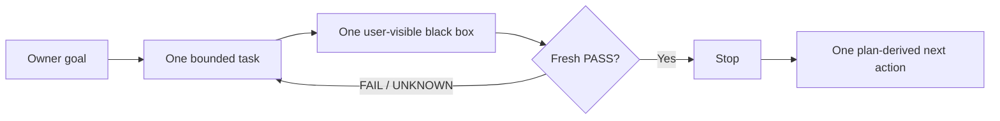

<a id="readme-top"></a>

<p align="center">
  <strong>English</strong>
  ·
  <a href="./README.zh-CN.md">简体中文</a>
</p>

<p align="center">
  
</p>

<h1 align="center">Oh No, Codex!</h1>

<p align="center">
  <strong>A fast, local anti-drift harness for Codex vibe coding.</strong>
</p>

<p align="center">
  One goal. One bounded task. One black-box test. Then stop.
</p>

<p align="center">
  <a href="https://github.com/t01089572455/oh-no-codex/blob/main/docs/IMPLEMENTATION-PLAN.md">
    
  </a>
  
  
  <a href="./LICENSE">
    
  </a>
</p>

<p align="center">
  <a href="#why">Why</a>
  ·
  <a href="#what-is-implemented">Features</a>
  ·
  <a href="#complete-usage-guide">Usage</a>
  ·
  <a href="#the-four-loops">Four loops</a>
  ·
  <a href="#oh-no-cockpit">Cockpit</a>
  ·
  <a href="#the-eighteen-sins">18 sins</a>
  ·
  <a href="#project-contracts">Docs</a>
</p>

> [!IMPORTANT]
> **V1 is `V1_TRIAL_ACCEPTED`.** The CLI loops, cooperative hooks, Git guard,
> read-only Cockpit, A14 browser matrix, and P01–P06 trial receipts pass on the
> named local black-box and disposable-project evidence. This is not a
> hostile-agent, production-authority, package-publication, or universal speed
> claim. No npm package has been published or released.

## Why

Codex can write good code and still let a project drift:

- a small request quietly becomes a new architecture;
- coding starts before the expected user behavior is clear;
- internal tests pass while the user-visible behavior remains broken;
- a requirement changes, but the governing documents do not;
- “next” is mistaken for permission to keep working;
- the next session spends an hour reconstructing the truth from chat.

Oh No, Codex! puts a lightweight harness around each task boundary. Before a
supported write, it asks for one bounded task and one minimal, user-visible
black-box test. At the finish line, fresh evidence—not agent prose—decides
whether the task stops.

It is a **cooperative project harness** for local Codex work. It is not an AI
security sandbox, an enterprise governance platform, or a promise that a
hostile process cannot bypass its owner.

## The four loops



The next action is a locator, not fresh authorization.

| Loop | Drift it prevents | Smallest useful behavior |
| --- | --- | --- |
| **Start** | Coding before the task is understood | Activate only the frozen cursor task: expected behavior, one test, allowed files, time budget, and stop condition. |
| **Finish** | “Looks done” completion claims | Run the exact black box and bind PASS to the current task and Git subject. |
| **Change** | Requirements and governing documents diverging | Select required documents from Owner-maintained Truth, show the exact diff, and block coding until review. |
| **Resume** | New sessions rebuilding state from prose | Return the goal, current task, proof, blocker, and one next action from one atomic state file. |

## What is implemented

**V1 harness scope is complete** as `V1_TRIAL_ACCEPTED` on named local black-box
and disposable-project evidence. That does **not** mean npm publication,
hostile-agent security, or a universal speed guarantee.

| Area | Commands / surfaces | Status |
| --- | --- | --- |
| Project bootstrap | `ohno init --goal …` | Done |
| Linear plan review | `ohno plan propose` · `ohno plan accept` | Done |
| Bounded task start | `ohno task start` (no free-form contract args) | Done |
| Evidence-bound finish | `ohno verify` | Done |
| Instant recovery | `ohno status` · `ohno resume` · `ohno next` | Done |
| Requirement change | `ohno change begin` · `diff` · `accept` | Done |
| Codex cooperative hooks | SessionStart / PostCompact / PreToolUse / Stop | Done |
| Git pre-commit guard | `ohno install` · `ohno git pre-commit` | Done |
| Hook introspection | `ohno hooks status --json` · `ohno hook` | Done |
| Read-only Cockpit | `ohno cockpit` (glass mission dashboard + plan board) | Done |
| Plan board projection | `status --json` field `plan_board` (DONE/HALF/READY/OUTLINE…) | Done |
| Generated progress + AGENTS block | `ohno projectors refresh` → `.ohno/PROGRESS.md` + managed AGENTS section | Done |
| Doctor health surface | `ohno doctor [--json]` | Done |
| Handoff identity | resume `HANDOFF_*` path/branch/head/dirty | Done |
| Atomic state authority | `.ohno/state.json` sole runtime authority | Done |
| Truth applicability | `.ohno/truth.json` Owner list | Done |

**Explicitly not done / not authorized**

| Item | Status |
| --- | --- |
| npm package publish / GitHub Release | Not authorized |
| Claude or multi-agent support | Out of V1 scope |
| Hostile same-user containment | Explicit non-goal |
| Database, daemon, hosted service, plugin platform | Explicit non-goals |

## Complete usage guide

> Install from this repository source. No published npm release exists yet.

### 0. Prerequisites

- Node.js **≥ 22.20**
- An ordinary **Git** repository (the project you want to harness)
- Optional: Codex CLI/TUI for hook integration

### 1. Build the CLI (once)

```bash
git clone https://github.com/t01089572455/oh-no-codex.git
cd oh-no-codex
npm ci
npm run build
```

Run it without a global install:

```bash
node dist/cli.js --help
# or, from another repo:
node /path/to/oh-no-codex/dist/cli.js <command>
```

Optional local bin link:

```bash
npm link
# then, inside your project:
ohno --help
```

### 2. Initialize a project

```bash
cd /path/to/your-git-project
ohno init --goal "Ship reliable draft persistence"
```

Creates / updates:

| Path | Role |
| --- | --- |
| `.ohno/state.json` | Sole current runtime authority |
| `.ohno/truth.json` | Owner-maintained governing-document list |

`init` refuses silent re-initialization. Goal changes go through the
requirement-change loop, not another `init`.

### 3. Propose and accept a linear plan

Write a review file (example: `.ohno/review-plan.json`):

```json
{
  "cursor": 0,
  "ordered_tasks": [
    {
      "id": "draft-persistence",
      "title": "Prove draft survives reload",
      "goal": "Users keep their draft after refresh",
      "status": "FROZEN",
      "expected_behavior": "A saved draft survives page reload",
      "test_command": "node --test test/draft-persistence.test.mjs",
      "stop_condition": "Stop after the draft black box passes",
      "allowed_files": ["src/draft/**", "test/draft-persistence.test.mjs"],
      "time_budget_minutes": 45
    },
    {
      "id": "polish-copy",
      "title": "Polish empty-state copy",
      "goal": "Empty state is clear",
      "status": "OUTLINE"
    }
  ]
}
```

Rules:

- The **cursor** task must be `FROZEN` (behavior, exact test, files, stop, budget).
- Later tasks may be `OUTLINE` (id + title + goal only).
- An `OUTLINE` at the cursor cannot start; next action is `FREEZE_TASK:<id>`.

```bash
ohno plan propose --file .ohno/review-plan.json
# copy the exact printed values:
ohno plan accept --revision <PLAN_REVISION> --diff <DIFF_DIGEST>
```

Acceptance records only `LOCAL_REVIEW_RECORDED` (local evidence), **not**
Owner identity or production authorization.

### 4. Start the cursor task

```bash
ohno task start
```

- No `--test` / `--files` / free-form next args: only the frozen cursor contract activates.
- Second start while active fails closed and preserves state bytes.
- Pending document sync also blocks start.

### 5. Implement, then verify with the exact black box

Do the work inside `allowed_files`. When ready:

```bash
ohno verify
```

| Result | Meaning |
| --- | --- |
| non-zero / timeout / unknown | Task stays **ACTIVE**; fix and re-verify |
| zero + stable subject | **PASS** receipt; cursor advances once |
| HEAD changes during the test | **UNKNOWN** (not PASS) |
| Later ordinary commit, subject unchanged | Proof stays **FRESH** |
| Contract / plan / scoped files change | Proof becomes **STALE** |

Optional cooperative Stop marker for Codex (only after a real PASS):

```text
OHNO_COMPLETE:<active-task-id>
```

### 6. Recover state in any new session

```bash
ohno status          # human-readable
ohno status --json   # machine-readable read model
ohno resume          # bounded capsule for a new session / post-compact
ohno next            # one plan-derived next action only
```

Typical next actions: `START_TASK:<id>`, `FREEZE_TASK:<id>`,
`SYNC_GOVERNING_DOCUMENTS`, `PROPOSE_PLAN`, `PROJECT_COMPLETE`.

### 7. Requirement change (Truth + exact diff)

When the Owner changes requirements:

```bash
ohno change begin --summary "Owner revised acceptance wording" --concerns docs
# edit governing docs + replacement plan as shown
ohno change diff
ohno change accept --change <CHANGE_ID> --diff <DISPLAYED_DIGEST>
```

While pending, the only safe next action is `SYNC_GOVERNING_DOCUMENTS`.
Supported mutation hooks deny unrelated implementation work.

### 8. Install cooperative hooks

Inside the project:

```bash
ohno install
ohno hooks status --json
```

| Hook | Job |
| --- | --- |
| SessionStart / PostCompact | Inject goal, task, proof, blocker, next |
| PreToolUse | Deny supported writes without contract / out of scope |
| Stop | Require exact `OHNO_COMPLETE:<id>` + fresh proof |
| Git pre-commit | Reject out-of-scope or stale proof commits |

Then review and trust the project hooks inside Codex. Hooks are
**cooperative guardrails**, not hostile-agent containment. Ordinary Git can
still use `--no-verify`.

### 9. Refresh projections (progress table + AGENTS managed block)

```bash
ohno projectors refresh
# or skip AGENTS.md:
ohno projectors refresh --no-agents
```

Writes:

| File | Meaning |
| --- | --- |
| `.ohno/PROGRESS.md` | Generated board/progress table (**not** authority) |
| `AGENTS.md` between `<!-- ohno:managed-begin/end -->` | Live capsule for agents; owner prose outside the block is preserved |

`task start`, `verify`, `plan accept`, and `change accept` also refresh
projections best-effort.

### 10. Open the Cockpit

```bash
ohno cockpit
# prints: Cockpit: http://127.0.0.1:<port>/
```

Open that loopback URL in a browser. The glass dashboard is **read-only** and
always projects the same model as `status --json` (no second authority). The
**PLAN BOARD** panel lists DONE / HALF / READY / OUTLINE rows from that model.

### End-to-end cheat sheet

```bash
ohno init --goal "…"
# edit .ohno/review-plan.json
ohno plan propose --file .ohno/review-plan.json
ohno plan accept --revision … --diff …
ohno task start
# implement within allowed_files
ohno verify
ohno resume
ohno next
ohno cockpit
```

## CLI core, thin hooks

The CLI owns the state and decisions. Hooks only bring those decisions to the
moment Codex is about to act:

| Surface | V1 job |
| --- | --- |
| `SessionStart` / `PostCompact` | Inject the goal, current task, proof, blocker, and one next action. |
| `PreToolUse` | Block supported writes when the task contract is missing or the path is outside the declared scope. |
| `Stop` | On the exact `OHNO_COMPLETE:<task-id>` marker, keep the task open unless proof is fresh and document sync is clean. Missing or paraphrased markers are not completion signals. |
| Git `pre-commit` | Reject an out-of-scope or unverified commit. |

Hooks are guardrails around cooperative Codex use—not an unbreakable security
boundary.

## One authority, several views

```text
ohno CLI -- atomic replace --> .ohno/state.json
                                  |-- status / resume / next
                                  |-- thin Codex hooks
                                  |-- Git pre-commit guard
                                  `-- read-only Cockpit

.ohno/truth.json -------------> named governing documents
```

- `.ohno/state.json` is the sole current runtime authority.
- `.ohno/truth.json` is the Owner-maintained document applicability list.
- Hooks, receipts, terminal output, and Cockpit are projections—not competing
  sources of truth.
- Normal read paths stay bounded: no whole-repository document scan and no
  full test suite.

## Small by design

V1 has one Node.js package, one `ohno` executable, one atomic state file, one
Truth list, thin project hooks, one Git hook, and one local read-only Cockpit.

It deliberately has no database, daemon, hosted service, policy language,
plugin platform, provider framework, or multi-agent scheduler. A new
abstraction earns its place only when a failing public black-box test needs it.

## Oh No Cockpit

The Cockpit is a local, GET-only **glass mission dashboard** that projects the
same read model as `ohno status --json`. It owns no state, cache, database, or
write route. Top navigation carries brand, current stage, overall progress,
and refresh. Instruments answer:

1. **What is happening now?** (`NOW`, mission pulse, calibration rail)
2. **What is the one next action?** (`NEXT`)
3. **Is proof fresh, and is anything blocking?** (`PROOF`, `DRIFT` / ATTENTION)

```bash
ohno cockpit
```

```text
+-- OH NO, CODEX! ------ CURRENT STAGE ------ PROGRESS ------ REFRESH --+
| NOW: draft-persistence     |   MISSION PULSE (ring)   | PROOF: FRESH  |
| expected user behavior     |   cursor / task count    | GUARDRAIL     |
| NEXT: START_TASK:…         |   CALIBRATION RAIL       | counts only   |
| ATTENTION / DRIFT          |                          | from state    |
| RECENT completed ledger    |                          |               |
+-- COMPLETION VECTOR --------------------------------------------------+
```

Honesty rules for the UI:

- progress = `cursor / task_count` only
- no invented “trust weather” percentages or fake metrics
- unavailable / corrupt state shows an explicit offline gate

| Color | Role |
| --- | --- |
| Soft lavender field `#F0EDF8` | glass dashboard surface |
| Purple / blue accents | navigation and active pulse |
| Teal / mint | fresh / clear |
| Amber | drift / attention |
| Red | blocked / fail |

## The eighteen sins

Codex’s **eighteen sins** are the audited anti-patterns this harness is built
against. Oh No, Codex! turns them into constraints, tests, or explicit
non-goals—not eighteen new subsystems.

<details>
<summary><strong>Open all 18</strong></summary>

| # | Sin | Product correction |
| ---: | --- | --- |
| 1 | **Semantic usurpation** | Preserve the Owner’s words; ambiguity selects the smallest satisfying behavior. |
| 2 | **Maximum interpretation** | No subsystem or abstraction without a current public RED. |
| 3 | **Never stopping** | Acceptance ends the task; `next` is not permission. |
| 4 | **Review becomes edit authority** | Review is read-only unless fixes are explicitly authorized. |
| 5 | **Zombie authority** | Current canonical state outranks old plans and summaries. |
| 6 | **Summary replaces truth** | Resume is a bounded projection, never a new authority. |
| 7 | **Local green equals complete** | Every claim names its exact evidence scope. |
| 8 | **Self-certified closure** | Exact commands and subject-bound receipts outrank agent prose. |
| 9 | **Test theatre** | Every task owns one minimal user-visible black box. |
| 10 | **Proxy goals take over** | Keep one Owner goal and one active bounded task visible. |
| 11 | **Reviewer denominator inflation** | Review against frozen acceptance; extra ideas remain proposals. |
| 12 | **Control-tax blindness** | Latency, capsule size, and no-full-scan paths are acceptance rows. |
| 13 | **Rebuilding the world** | Prefer Git, files, and ordinary tests before new machinery. |
| 14 | **Workspace identity confusion** | Handoffs name path, branch, commit, tree, and dirty state. |
| 15 | **Handoff tax on the user** | One `resume` command returns the operational capsule. |
| 16 | **UX debt last** | Freeze the Cockpit design before code; accept it in the browser. |
| 17 | **Agreement plus overconfidence** | Use honest capability labels and measured evidence. |
| 18 | **Apology without constraint** | Every confirmed incident becomes a rule, regression, or non-goal. |

Read the privacy-scrubbed audit and evidence boundary in
[`docs/CODEX-SINS.md`](https://github.com/t01089572455/oh-no-codex/blob/main/docs/CODEX-SINS.md).

</details>

## Evidence, not promises

Capability labels name the evidence actually held by this repository:

| Capability | Status | Evidence boundary |
| --- | --- | --- |
| CLI state, plan, verify, resume, change, hooks, and atomic-write behavior | `LOCAL_PASS` | Public Node black boxes A01–A12, A15, and A16 |
| Read-only Cockpit projection | `LOCAL_PASS` | A13 HTTP equality with `status --json` |
| Three copied-project loops and P01–P05 | `TRIAL_PASS` | Bounded harness trials on anonymous TypeScript CLI, React/Vite Web, and Python OCR source copies |
| Desktop/narrow visual and accessibility acceptance | `LOCAL_PASS` | A14 via system Chrome/Edge after Owner authorized external browser |
| State-to-Cockpit browser reflection | `TRIAL_PASS` | P06 three-copy browser receipt; worst p95 73.690 ms |
| npm publication or release | `UNAVAILABLE` | Not authorized and not performed |

The three-copy measurements use one untimed warm-up and 30 raw samples per
command per copy. Worst observed p95 values were:

| Surface | Frozen budget | Worst observed | Result |
| --- | ---: | ---: | --- |
| `ohno status` | `<250 ms` | `92.249 ms` | `TRIAL_PASS` |
| `ohno next` | `<250 ms` | `84.213 ms` | `TRIAL_PASS` |
| `ohno resume` | `<500 ms` | `85.938 ms` | `TRIAL_PASS` |
| Largest accepted resume capsule | `<4096 bytes` | `3194 bytes` | `TRIAL_PASS` |
| Task-start harness overhead | `<2000 ms` | `97.667 ms` | `TRIAL_PASS` |
| State-to-Cockpit browser reflection | `<250 ms` | `73.690 ms` | `TRIAL_PASS` |

These are local trial results for the named anonymous copies and machine, not
a universal speed or production-readiness guarantee.

## Project contracts

Public product truth lives in a small set of documents:

1. [Product contract](https://github.com/t01089572455/oh-no-codex/blob/main/docs/PRODUCT-CONTRACT.md)
2. [V1 design](https://github.com/t01089572455/oh-no-codex/blob/main/docs/DESIGN.md)
3. [Acceptance contract](https://github.com/t01089572455/oh-no-codex/blob/main/docs/ACCEPTANCE.md)
4. [Implementation ledger](https://github.com/t01089572455/oh-no-codex/blob/main/docs/IMPLEMENTATION-PLAN.md)
5. [The Codex sins](https://github.com/t01089572455/oh-no-codex/blob/main/docs/CODEX-SINS.md)

## License

[MIT](./LICENSE)

Oh No, Codex! is an independent community project and is not affiliated with
or endorsed by OpenAI.

<p align="center">
  <strong>Measure the task. Prove the behavior. Stop the agent.</strong>
</p>

<p align="center"><a href="#readme-top">Back to top ↑</a></p>
