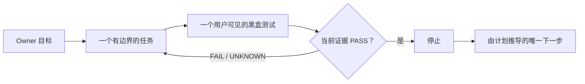

<a id="readme-top"></a>

<p align="center">
  <a href="./README.md">English</a>
  ·
  <strong>简体中文</strong>
</p>

<p align="center">
  
</p>

<h1 align="center">Oh No, Codex!</h1>

<p align="center">
  <strong>一个快速、本地、专门防止 Codex vibe coding 漂移的 Harness。</strong>
</p>

<p align="center">
  一个目标。一个有边界的任务。一个黑盒测试。通过就停。
</p>

<p align="center">
  <a href="https://github.com/t01089572455/oh-no-codex/blob/main/docs/IMPLEMENTATION-PLAN.md">
    
  </a>
  
  
  <a href="./LICENSE">
    
  </a>
</p>

<p align="center">
  <a href="#为什么需要它">为什么</a>
  ·
  <a href="#已经实现了哪些功能">功能清单</a>
  ·
  <a href="#完整使用说明">使用说明</a>
  ·
  <a href="#四个闭环">四个闭环</a>
  ·
  <a href="#oh-no-驾驶舱">驾驶舱</a>
  ·
  <a href="#codex-十八宗罪">十八宗罪</a>
  ·
  <a href="#项目合同">文档</a>
</p>

> [!IMPORTANT]
> **V1 状态为 `V1_TRIAL_ACCEPTED`。** 在命名本地黑盒与可弃用项目副本证据上已
> 具备：CLI 闭环（init / plan / task / verify / status·resume·next / change）、
> 合作式 Hooks + Git pre-commit、只读玻璃驾驶舱与计划看板（轮询 `/api/state`）、
> 投影（`.ohno/PROGRESS.md` + AGENTS 托管块）、`ohno doctor`、handoff 身份、
> A14 浏览器矩阵与 P01–P06 试验收据。公开账本：Tasks 1–7、Corrections 1–2、
> 精华 E1–E8。这**不是**敌对 Agent 防护、生产权威或普适速度声明。
> 安装：`npm install -g oh-no-codex`。

## 为什么需要它

Codex 能写出不错的代码，也仍然可能把项目带偏：

- 一个小需求悄悄膨胀成一套新架构；
- 用户预期还没说清楚，编码已经开始；
- 内部测试全绿，但用户真正看到的功能仍然坏着；
- 需求已经变化，规范文档却没有一起更新；
- “下一步是什么”被误解成“可以继续做”；
- 新 Session 先花一个小时从聊天记录里重建现场。

Oh No, Codex! 在每个任务边界套上一层轻量约束。执行受支持的写操作前，
先固定一个有边界的任务和一个最小、用户可见的黑盒测试；到达终点后，
由新鲜证据决定是否停止，而不是由 Agent 自己说“完成了”。

它是面向本地 Codex 开发的**合作型项目 Harness**，不是 AI 安全沙箱，
不是企业治理平台，也不承诺能阻止 Owner 权限下的恶意进程。

## 四个闭环



“下一步”只是定位信息，不是新的执行授权。

| 闭环 | 防止什么漂移 | 最小有用行为 |
| --- | --- | --- |
| **开始** | 任务没想清楚就开写 | 只激活 cursor 指向的冻结任务：预期行为、一个测试、文件范围、时间预算和停止条件。 |
| **完成** | “看起来好了”冒充完成 | 执行指定黑盒，并把 PASS 绑定到当前任务和 Git 对象。 |
| **变更** | 需求与规范文档不同步 | 从 Owner 维护的 Truth 清单确定必改文档，展示精确 diff，确认前阻止编码。 |
| **恢复** | 新 Session 从聊天里拼现场 | 从一个原子状态文件返回目标、当前任务、证据、阻塞和唯一下一步。 |

## 已经实现了哪些功能

**V1 Harness 范围已完成**，账本状态为 `V1_TRIAL_ACCEPTED`（基于命名本地黑盒与
可弃用项目副本证据）。这**不等于**已发布 npm、不等于敌对 Agent 安全产品、
也不等于普适速度保证。

| 能力域 | 命令 / 表面 | 状态 |
| --- | --- | --- |
| 项目初始化 | `ohno init --goal …` | 已完成 |
| 线性计划评审 | `ohno plan propose` · `ohno plan accept` | 已完成 |
| 有边界任务启动 | `ohno task start`（不能自填合同字段） | 已完成 |
| 证据绑定完成 | `ohno verify` | 已完成 |
| 秒级恢复现场 | `ohno status` · `ohno resume` · `ohno next` | 已完成 |
| 需求变更同步 | `ohno change begin` · `diff` · `accept` | 已完成 |
| Codex 合作式 Hooks | SessionStart / PostCompact / PreToolUse / Stop | 已完成 |
| Git pre-commit 护栏 | `ohno install` · `ohno git pre-commit` | 已完成 |
| Hook 状态查询 | `ohno hooks status --json` · `ohno hook` | 已完成 |
| 只读驾驶舱 | `ohno cockpit`（玻璃态任务仪表盘 + 计划看板） | 已完成 |
| 计划看板投影 | `status --json` 的 `plan_board`（DONE/HALF/READY/OUTLINE…） | 已完成 |
| 生成式进度/AGENTS 托管块 | `ohno projectors refresh` → `.ohno/PROGRESS.md` + `AGENTS.md` 托管段 | 已完成 |
| 健康检查 | `ohno doctor [--json]` | 已完成 |
| Handoff 身份 | resume 中的 path/branch/head/dirty | 已完成 |
| 原子状态权威 | `.ohno/state.json` 唯一运行时权威 | 已完成 |
| Truth 适用清单 | `.ohno/truth.json` 由 Owner 维护 | 已完成 |

**明确未做 / 未授权**

| 项目 | 状态 |
| --- | --- |
| 多租户托管 SaaS | 超出范围 |
| Claude 或多 Agent 支持 | 超出 V1 |
| 敌对同用户进程硬隔离 | 明确非目标 |
| 数据库、守护进程、托管服务、插件平台 | 明确非目标 |

## 完整使用说明

> 推荐从 npm 安装；也支持源码构建。

### 0. 前置条件

- Node.js **≥ 22.20**
- 目标项目是普通 **Git** 仓库
- 可选：Codex CLI/TUI（用于安装并信任项目 Hooks）

### 1. 安装 CLI

```bash
npm install -g oh-no-codex
ohno --help
```

或不用全局安装：

```bash
npx oh-no-codex --help
```

源码开发：

```bash
git clone https://github.com/t01089572455/oh-no-codex.git
cd oh-no-codex
npm ci
npm run build
node dist/cli.js --help
```

### 2. 初始化业务项目

```bash
cd /path/to/your-git-project
ohno init --goal "让草稿保存可靠"
```

会创建/更新：

| 路径 | 作用 |
| --- | --- |
| `.ohno/state.json` | 唯一当前运行时权威 |
| `.ohno/truth.json` | Owner 维护的规范文档清单 |
| `AGENTS.md` | 带 Oh No 托管投影块的脚手架 |
| `.ohno/PROGRESS.md` | 生成式进度看板（init 时尽量写出） |

`init` 禁止静默重复初始化。目标变更走需求变更闭环，不要再 `init` 一次。

### 3. 提议并接受线性计划

编写评审文件（例如 `.ohno/review-plan.json`）：

```json
{
  "cursor": 0,
  "ordered_tasks": [
    {
      "id": "draft-persistence",
      "title": "证明草稿刷新后仍在",
      "goal": "用户刷新后仍能看到草稿",
      "status": "FROZEN",
      "expected_behavior": "保存后的草稿在刷新页面后仍然存在",
      "test_command": "node --test test/draft-persistence.test.mjs",
      "stop_condition": "黑盒通过后立即停止",
      "allowed_files": ["src/draft/**", "test/draft-persistence.test.mjs"],
      "time_budget_minutes": 45
    },
    {
      "id": "polish-copy",
      "title": "润色空状态文案",
      "goal": "空状态说清楚",
      "status": "OUTLINE"
    }
  ]
}
```

规则：

- **cursor** 任务必须是 `FROZEN`（预期行为、精确测试、文件范围、停止条件、预算）
- 后续任务可以是 `OUTLINE`（只需 id + 标题 + 目标）
- cursor 指向 `OUTLINE` 时不能启动，唯一下一步是 `FREEZE_TASK:<id>`

```bash
ohno plan propose --file .ohno/review-plan.json
# 原样复制输出中的精确值：
ohno plan accept --revision <PLAN_REVISION> --diff <DIFF_DIGEST>
```

接受只记录 `LOCAL_REVIEW_RECORDED`（本地评审证据），**不**声称 Owner 身份或
生产授权。

### 4. 启动 cursor 任务

```bash
ohno task start
```

- 不能传 `--test` / `--files` / 自由 next：只激活冻结合同
- 已有活跃任务时二次启动会失败并保持原状态字节
- 文档同步 pending 时也会阻止启动

### 5. 实现后用精确黑盒验收

在 `allowed_files` 范围内改代码，然后：

```bash
ohno verify
```

| 结果 | 含义 |
| --- | --- |
| 非零 / 超时 / 未知 | 任务仍为 **ACTIVE**，修好再验 |
| 零退出 + 作用域内容未变 | **PASS** 收据，cursor 前进一格 |
| 测试过程中 HEAD 变化 | **UNKNOWN**（不是 PASS） |
| 之后普通 commit、作用域未变 | 证明仍为 **FRESH** |
| 合同 / 计划 / 作用域文件变化 | 证明变为 **STALE** |

Codex 可选完成标记（仅在真实 PASS 后）：

```text
OHNO_COMPLETE:<active-task-id>
```

### 6. 任意新 Session 恢复现场

```bash
ohno status          # 人类可读
ohno status --json   # 机器可读 read model
ohno resume          # 有界摘要，给新 Session / 压缩后使用
ohno next            # 只输出计划推导的唯一下一步
```

常见 next：`START_TASK:<id>`、`FREEZE_TASK:<id>`、
`SYNC_GOVERNING_DOCUMENTS`、`PROPOSE_PLAN`、`PROJECT_COMPLETE`。

### 7. 需求变更（Truth + 精确 diff）

Owner 改需求时：

```bash
ohno change begin --summary "Owner 修订了验收表述" --concerns docs
# 按提示修改规范文档与替换计划
ohno change diff
ohno change accept --change <CHANGE_ID> --diff <DISPLAYED_DIGEST>
```

pending 期间唯一下一步是 `SYNC_GOVERNING_DOCUMENTS`；受支持的写 Hook 会阻止
无关实现工作。

### 8. 安装合作式 Hooks

在业务项目中：

```bash
ohno install
ohno hooks status --json
```

| Hook | 职责 |
| --- | --- |
| SessionStart / PostCompact | 注入目标、任务、证据、阻塞、下一步 |
| PreToolUse | 无合同或超范围时拒绝受支持写操作 |
| Stop | 要求精确 `OHNO_COMPLETE:<id>` + 新鲜 PASS |
| Git pre-commit | 拒绝超范围或过期证明的提交 |

然后在 Codex 里审查并信任项目 Hooks。Hooks 是**合作型护栏**，不是敌对安全
边界；普通 Git 仍可用 `--no-verify` 绕过。

### 9. 刷新投影（进度表 + AGENTS 托管块）

```bash
ohno projectors refresh
# 或只写进度、不碰 AGENTS.md：
ohno projectors refresh --no-agents
```

会生成：

| 文件 | 含义 |
| --- | --- |
| `.ohno/PROGRESS.md` | 从 state 生成的进度表（**不是**权威，勿手改当真相） |
| `AGENTS.md` 中 `<!-- ohno:managed-begin/end -->` 段 | 注入目标/看板/下一步；**块外**仍是你的规则 |

`task start` / `verify` / `plan accept` / `change accept` 成功后也会尽量自动刷新投影。

### 10. 打开驾驶舱

```bash
ohno cockpit
# 打印：Cockpit: http://127.0.0.1:<port>/
```

用浏览器打开该 loopback 地址。玻璃态仪表盘**只读**，并与 `status --json`
使用同一 read model（没有第二套权威）。右侧 **PLAN BOARD** 用
DONE / HALF / READY / OUTLINE 等相位显示整张计划表。

### 端到端速查

```bash
ohno init --goal "…"
# 编辑 .ohno/review-plan.json
ohno plan propose --file .ohno/review-plan.json
ohno plan accept --revision … --diff …
ohno task start
# 在 allowed_files 内实现
ohno verify
ohno install                 # 可选：合作式 hooks
ohno doctor                  # 健康检查
ohno projectors refresh      # PROGRESS.md + AGENTS 托管块
ohno resume
ohno next
ohno cockpit                 # GET /api/state，约 2.5s 轮询
```

## CLI 内核，薄 Hooks

CLI 掌握状态和判断；Hooks 只负责在 Codex 即将行动的时刻执行这些判断：

| 接入点 | V1 职责 |
| --- | --- |
| `SessionStart` / `PostCompact` | 尽量刷新投影，再注入有界 resume 胶囊（目标、看板、证据、阻塞、下一步、handoff）。 |
| `PreToolUse` | 缺少任务合同，或路径超出声明范围时，阻止受支持的写操作。 |
| `Stop` | 只在看到精确的 `OHNO_COMPLETE:<task-id>` 标记时检查：若 PASS 不新鲜或文档同步未清理，则保持任务未完成。缺失或改写过的标记不算完成信号。 |
| Git `pre-commit` | 拒绝超范围或未经验证的提交。 |

Hooks 是约束合作型 Codex 的护栏，不是不可绕过的安全边界。

## 一个权威，多个视图

```text
ohno CLI -- 原子替换 --> .ohno/state.json   （唯一运行时权威）
                              |-- status / resume / next / doctor
                              |-- 薄 Codex Hooks（注入 capsule）
                              |-- Git pre-commit 护栏
                              |-- projectors → .ohno/PROGRESS.md
                              |               → AGENTS.md 托管块
                              `-- 只读驾驶舱 ← GET /api/state（轮询）

.ohno/truth.json ----------> 指定的规范文档
```

- `.ohno/state.json` 是唯一的当前运行时权威。
- `.ohno/truth.json` 是由 Owner 维护的规范文档适用清单。
- Hooks、收据、终端输出、PROGRESS、AGENTS 托管块和驾驶舱都只是投影，
  不会建立第二套真相。
- 正常读取只看有边界的小状态，不扫描全部文档，也不运行完整测试套件。

## 刻意保持简单

V1 只有一个 Node.js 包、一个 `ohno` 命令、一个原子状态文件、一个 Truth
清单、薄 Codex Hooks、一个 Git Hook 和一个本地只读驾驶舱。

V1 不做数据库、后台守护进程、托管服务、策略语言、插件平台、Provider
框架或多 Agent 调度器。只有当前公共黑盒测试真实失败时，新抽象才有资格
进入产品。

## Oh No 驾驶舱

驾驶舱是本地、仅 GET 的**玻璃态任务仪表盘**，与 `ohno status --json` 共用
同一 read model；没有自有状态、缓存、数据库或写接口。顶栏导航包含品牌、
当前阶段、总进度与刷新。面板回答：

1. **现在在做什么？**（NOW、任务环、校准轨）
2. **唯一下一步是什么？**（NEXT）
3. **证明是否新鲜、有没有阻塞？**（PROOF、DRIFT / ATTENTION）

```bash
ohno cockpit
```

```text
+-- OH NO, CODEX! ---- 当前阶段 ---- 总进度 ---- REFRESH --+
| NOW / NEXT / ATTENTION |  任务环 + 校准轨     | PROOF     |
| RECENT 已完成          |  cursor / 任务数     | PLAN BOARD|
|                        |                      | Truth 列表|
|                        |                      | Handoff   |
+-- COMPLETION VECTOR（约 2.5s 轮询 /api/state） ----------+
```

UI 诚实规则：

- 所有面板绑定与 `status --json` 相同的 `/api/state` 模型
- 进度只等于 `cursor / task_count`
- 不发明“信任天气”百分比或假指标
- 状态不可用/损坏时显示明确离线门
- 只读：UI 不写权威

| 颜色 | 用途 |
| --- | --- |
| 淡紫字段 `#F0EDF8` | 玻璃仪表盘底色 |
| 紫 / 蓝强调色 | 导航与进行中脉冲 |
| 青绿 / 薄荷 | 新鲜 / 通畅 |
| 琥珀 | 漂移 / 注意 |
| 红色 | 阻塞 / 失败 |

## Codex 十八宗罪

**Codex 十八宗罪**是本 harness 要对抗的审计失败模式。
Oh No, Codex! 把它们变成约束、测试或明确不做的事情，而不是再造 18 个
子系统。

<details>
<summary><strong>展开全部 18 条</strong></summary>

| # | 罪 | 产品约束 |
| ---: | --- | --- |
| 1 | **越俎代庖** | 保留 Owner 原话，含糊时选择最小满足方案。 |
| 2 | **把含糊词解释到最大** | 没有当前公共红测，就不新增子系统或抽象。 |
| 3 | **完成以后不停** | 验收通过就结束，`next` 不是继续授权。 |
| 4 | **把审查当修改权** | 审查默认只读，修复必须另有明确授权。 |
| 5 | **旧权威复活** | 当前权威高于旧计划与旧摘要。 |
| 6 | **用摘要改写真相** | 恢复摘要只是投影，不能成为新权威。 |
| 7 | **局部绿灯冒充完成** | 每个结论都必须说明精确证据范围。 |
| 8 | **同一 Agent 自证闭环** | 精确命令与对象绑定收据高于 Agent 自述。 |
| 9 | **测试戏剧** | 每个任务必须有一个最小、用户可见的黑盒测试。 |
| 10 | **代理目标反客为主** | 始终只突出一个 Owner 目标和一个当前任务。 |
| 11 | **Reviewer 扩大分母** | 按冻结验收审查，额外想法只能是建议。 |
| 12 | **对控制税失明** | 延迟、摘要大小与禁止全量扫描都必须实测。 |
| 13 | **重造轮子** | 优先使用 Git、文件和普通测试，不重造基础设施。 |
| 14 | **工作区身份混乱** | 交接必须给出路径、分支、commit、tree 与脏状态。 |
| 15 | **把交接税转嫁给用户** | 一条 `resume` 命令直接返回可执行现场。 |
| 16 | **用户体验最后偿还** | 先冻结驾驶舱设计，再编码并通过浏览器验收。 |
| 17 | **附和与过度自信** | 使用诚实能力标签，只说已经测得的结论。 |
| 18 | **道歉没有变成约束** | 每次确认的问题都要落成规则、回归测试或明确不做。 |

完整的脱敏审计与证据边界见
[`docs/CODEX-SINS.md`](https://github.com/t01089572455/oh-no-codex/blob/main/docs/CODEX-SINS.md)。

</details>

## 用证据，不用口号

能力标签只描述仓库当前真正持有的证据：

| 能力 | 状态 | 证据边界 |
| --- | --- | --- |
| 公开产品状态 | `V1_TRIAL_ACCEPTED` | 账本 Tasks 1–7 + Corrections 1–2 + 精华 E1–E8 |
| CLI 状态、计划、验证、恢复、变更、Hooks 与原子写行为 | `LOCAL_PASS` | 公共 Node 黑盒 A01–A12、A15、A16 |
| 计划看板、投影、doctor、handoff 身份 | `LOCAL_PASS` | projectors / resume-status-next / hooks 黑盒 |
| 只读驾驶舱投影 | `LOCAL_PASS` | A13 HTTP 输出与 `status --json` 相等 |
| 三个项目副本的完整闭环与 P01–P05 | `TRIAL_PASS` | 匿名 TypeScript CLI、React/Vite Web 与 Python OCR 源码副本上的有界 harness 试验 |
| 桌面/窄屏视觉与无障碍验收 | `LOCAL_PASS` | Owner 授权外置浏览器后，用系统 Chrome/Edge 完成 A14 |
| 状态到驾驶舱的浏览器反映延迟 | `TRIAL_PASS` | P06 三副本浏览器收据；最差 p95 73.690 ms |
| npm 包 `oh-no-codex` | 随发布提交上线 | `npm install -g oh-no-codex` |

三个副本的测量均先做一次不计时 warm-up，再对每条命令保存 30 个原始样本。
最差 p95 如下：

| 场景 | 冻结预算 | 最差观测值 | 结果 |
| --- | ---: | ---: | --- |
| `ohno status` | `<250 ms` | `92.249 ms` | `TRIAL_PASS` |
| `ohno next` | `<250 ms` | `84.213 ms` | `TRIAL_PASS` |
| `ohno resume` | `<500 ms` | `85.938 ms` | `TRIAL_PASS` |
| 最大合法恢复摘要 | `<4096 bytes` | `3194 bytes` | `TRIAL_PASS` |
| 任务启动 Harness 开销 | `<2000 ms` | `97.667 ms` | `TRIAL_PASS` |
| 状态到驾驶舱的浏览器反映延迟 | `<250 ms` | `73.690 ms` | `TRIAL_PASS` |

这些只是指定匿名副本与本机上的试验结果，不是通用速度或生产就绪保证。

## 项目合同

公开产品事实只由下面这组小而明确的文档管理：

1. [产品合同](https://github.com/t01089572455/oh-no-codex/blob/main/docs/PRODUCT-CONTRACT.md)
2. [V1 设计](https://github.com/t01089572455/oh-no-codex/blob/main/docs/DESIGN.md)
3. [验收合同](https://github.com/t01089572455/oh-no-codex/blob/main/docs/ACCEPTANCE.md)
4. [实现账本](https://github.com/t01089572455/oh-no-codex/blob/main/docs/IMPLEMENTATION-PLAN.md)（当前状态：`V1_TRIAL_ACCEPTED`）
5. [Codex 十八宗罪](https://github.com/t01089572455/oh-no-codex/blob/main/docs/CODEX-SINS.md)
6. [精华迁移清单](https://github.com/t01089572455/oh-no-codex/blob/main/docs/ESSENCE-BACKLOG.md)（E1–E8 已完成）

## 开源许可

[MIT](./LICENSE)

Oh No, Codex! 是独立社区项目，与 OpenAI 没有隶属关系，也未获得 OpenAI
官方背书。

<p align="center">
  <strong>量好边界，验证行为，然后让 Agent 停手。</strong>
</p>

<p align="center"><a href="#readme-top">返回顶部 ↑</a></p>
