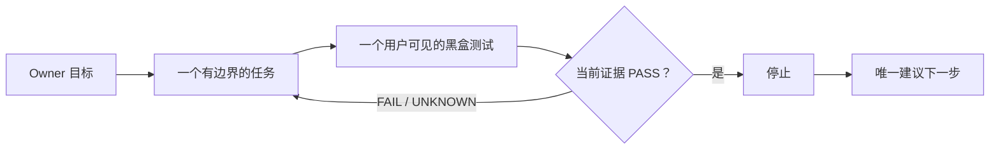

<a id="readme-top"></a>

<p align="center">
  <a href="https://github.com/t01089572455/oh-no-codex">English</a>
  ·
  <strong>简体中文</strong>
</p>

<p align="center">
  
</p>

<h1 align="center">Oh No, Codex!</h1>

<p align="center">
  <strong>一个快速、本地、专门防止 Codex vibe coding 漂移的 Harness。</strong>
</p>

<p align="center">
  一个目标。一个有边界的任务。一个黑盒测试。通过就停。
</p>

<p align="center">
  <a href="./docs/IMPLEMENTATION-PLAN.md">
    
  </a>
  
  
  <a href="./LICENSE">
    
  </a>
</p>

<p align="center">
  <a href="#为什么需要它">为什么</a>
  ·
  <a href="#四个闭环">四个闭环</a>
  ·
  <a href="#oh-no-驾驶舱">驾驶舱</a>
  ·
  <a href="#codex-十八宗罪">十八宗罪</a>
  ·
  <a href="#项目合同">文档</a>
</p>

> [!IMPORTANT]
> **V1 正在实现。** 目前没有发布任何安装包。下面的命令、Hooks、性能目标和
> 驾驶舱描述的是已经确认的产品合同，不代表它们现在已经可用。

## 为什么需要它

Codex 能写出不错的代码，也仍然可能把项目带偏：

- 一个小需求悄悄膨胀成一套新架构；
- 用户预期还没说清楚，编码已经开始；
- 内部测试全绿，但用户真正看到的功能仍然坏着；
- 需求已经变化，规范文档却没有一起更新；
- “下一步是什么”被误解成“可以继续做”；
- 新 Session 先花一个小时从聊天记录里重建现场。

Oh No, Codex! 在每个任务边界套上一层轻量约束。执行受支持的写操作前，
先固定一个有边界的任务和一个最小、用户可见的黑盒测试；到达终点后，
由新鲜证据决定是否停止，而不是由 Agent 自己说“完成了”。

它是面向本地 Codex 开发的**合作型项目 Harness**，不是 AI 安全沙箱，
不是企业治理平台，也不承诺能阻止 Owner 权限下的恶意进程。

## 四个闭环



“下一步”只是定位信息，不是新的执行授权。

| 闭环 | 防止什么漂移 | 最小有用行为 |
| --- | --- | --- |
| **开始** | 任务没想清楚就开写 | 固定预期行为、一个测试、文件范围、时间预算、停止条件和唯一下一步。 |
| **完成** | “看起来好了”冒充完成 | 执行指定黑盒，并把 PASS 绑定到当前任务和 Git 对象。 |
| **变更** | 需求与规范文档不同步 | 从 Owner 维护的 Truth 清单确定必改文档，展示精确 diff，确认前阻止编码。 |
| **恢复** | 新 Session 从聊天里拼现场 | 从一个原子状态文件返回目标、当前任务、证据、阻塞和唯一下一步。 |

## 30 秒合同预览

> 下面的接口已经完成设计，但软件尚未发布。

```bash
# 固定一个项目目标
ohno init --goal "让草稿保存可靠"

# 开始一个有边界的任务
ohno task start \
  --id "draft-persistence" \
  --expect "保存后的草稿在刷新页面后仍然存在" \
  --test "npm test -- draft-persistence" \
  --files "src/drafts/**,test/draft-persistence.test.*" \
  --minutes 60 \
  --stop "黑盒测试通过后立即停止" \
  --next "增加草稿删除"

# 让证据决定是否完成，并让任何新 Session 一条命令恢复现场
ohno verify
ohno resume
ohno next
```

## CLI 内核，薄 Hooks

CLI 掌握状态和判断；Hooks 只负责在 Codex 即将行动的时刻执行这些判断：

| 接入点 | V1 职责 |
| --- | --- |
| `SessionStart` / `PostCompact` | 注入目标、当前任务、证据、阻塞和唯一下一步。 |
| `PreToolUse` | 缺少任务合同，或路径超出声明范围时，阻止受支持的写操作。 |
| `Stop` | 缺少新鲜 PASS 或仍有规范文档待同步时，保持任务未完成。 |
| Git `pre-commit` | 拒绝超范围或未经验证的提交。 |

Hooks 是约束合作型 Codex 的护栏，不是不可绕过的安全边界。

## 一个权威，多个视图

```text
ohno CLI -- 原子替换 --> .ohno/state.json
                              |-- status / resume / next
                              |-- 薄 Codex Hooks
                              |-- Git pre-commit 护栏
                              `-- 只读驾驶舱

.ohno/truth.json ----------> 指定的规范文档
```

- `.ohno/state.json` 是唯一的当前运行时权威。
- `.ohno/truth.json` 是由 Owner 维护的规范文档适用清单。
- Hooks、收据、终端输出和驾驶舱都只是投影，不会建立第二套真相。
- 正常读取只看有边界的小状态，不扫描全部文档，也不运行完整测试套件。

## 刻意保持简单

V1 只有一个 Node.js 包、一个 `ohno` 命令、一个原子状态文件、一个 Truth
清单、薄 Codex Hooks、一个 Git Hook 和一个本地只读驾驶舱。

V1 不做数据库、后台守护进程、托管服务、策略语言、插件平台、Provider
框架或多 Agent 调度器。只有当前公共黑盒测试真实失败时，新抽象才有资格
进入产品。

## Oh No 驾驶舱

计划中的驾驶舱是只读的现场恢复界面，不是通用 SaaS 后台。最大的视觉
区域只回答两个问题：

1. **现在在做什么？**
2. **唯一下一步是什么？**

> [!NOTE]
> **这里只是预览占位，驾驶舱尚未实现。** 只有真实运行的界面通过视觉、
> 响应式、无障碍和功能验收后，才会用桌面与窄屏截图替换下面的面板。

```text
+-- OH NO 驾驶舱 ------------------------------ 本地 / 只读 --+
| 当前                                                             |
| draft-persistence                                  进行中  42m   |
| 保存后的草稿在刷新页面后仍然存在                               |
|                                                                  |
| 证据                          | 漂移状态                          |
| UNKNOWN                       | CLEAN                             |
| npm test -- draft-persistence | 规范文档已对齐                    |
|                                                                  |
| 唯一下一步                                                       |
| 运行指定的黑盒测试                                               |
+------------------------------------------------------------------+
```

计划配色严格跟随产品语义：

| 颜色 | 用途 |
| --- | --- |
| 暖奶油色 `#FFF1CE` | 仪表表面 |
| 炭黑色 `#202624` | 结构与文字 |
| 珊瑚红 `#FF4B35` | 阻塞或过期 |
| 琥珀色 `#F4AA2A` | 当前进行中 |
| 薄荷绿 `#74D6B1` | 只表示新鲜 PASS |

## Codex 十八宗罪

最初的简称是“Codex 十宗罪”，实际审计后拆出了 18 种彼此独立的模式。
Oh No, Codex! 把它们变成约束、测试或明确不做的事情，而不是再造 18 个
子系统。

<details>
<summary><strong>展开全部 18 条</strong></summary>

| # | 罪 | 产品约束 |
| ---: | --- | --- |
| 1 | **越俎代庖** | 保留 Owner 原话，含糊时选择最小满足方案。 |
| 2 | **把含糊词解释到最大** | 没有当前公共红测，就不新增子系统或抽象。 |
| 3 | **完成以后不停** | 验收通过就结束，`next` 不是继续授权。 |
| 4 | **把审查当修改权** | 审查默认只读，修复必须另有明确授权。 |
| 5 | **旧权威复活** | 当前权威高于旧计划与旧摘要。 |
| 6 | **用摘要改写真相** | 恢复摘要只是投影，不能成为新权威。 |
| 7 | **局部绿灯冒充完成** | 每个结论都必须说明精确证据范围。 |
| 8 | **同一 Agent 自证闭环** | 精确命令与对象绑定收据高于 Agent 自述。 |
| 9 | **测试戏剧** | 每个任务必须有一个最小、用户可见的黑盒测试。 |
| 10 | **代理目标反客为主** | 始终只突出一个 Owner 目标和一个当前任务。 |
| 11 | **Reviewer 扩大分母** | 按冻结验收审查，额外想法只能是建议。 |
| 12 | **对控制税失明** | 延迟、摘要大小与禁止全量扫描都必须实测。 |
| 13 | **重造轮子** | 优先使用 Git、文件和普通测试，不重造基础设施。 |
| 14 | **工作区身份混乱** | 交接必须给出路径、分支、commit、tree 与脏状态。 |
| 15 | **把交接税转嫁给用户** | 一条 `resume` 命令直接返回可执行现场。 |
| 16 | **用户体验最后偿还** | 先冻结驾驶舱设计，再编码并通过浏览器验收。 |
| 17 | **附和与过度自信** | 使用诚实能力标签，只说已经测得的结论。 |
| 18 | **道歉没有变成约束** | 每次确认的问题都要落成规则、回归测试或明确不做。 |

完整的脱敏审计与证据边界见
[`docs/CODEX-SINS.md`](./docs/CODEX-SINS.md)。

</details>

## 用证据，不用口号

下面是 V1 的验收目标。在三个一次性真实项目副本完成测量之前，它们都
不是已经兑现的性能承诺。

| 场景 | 目标 |
| --- | ---: |
| `ohno status` / `ohno next` | 本地 p95 `<250 ms` |
| `ohno resume` | 本地 p95 `<500 ms` |
| 恢复摘要 | `<4 KiB` |
| 任务启动控制开销 | `<2 s`，不含用户测试 |
| 状态反映到驾驶舱 | 本地 p95 `<250 ms` |

## 项目合同

公开产品事实只由下面这组小而明确的文档管理：

1. [产品合同](./docs/PRODUCT-CONTRACT.md)
2. [V1 设计](./docs/DESIGN.md)
3. [验收合同](./docs/ACCEPTANCE.md)
4. [实现账本](./docs/IMPLEMENTATION-PLAN.md)
5. [Codex 十八宗罪](./docs/CODEX-SINS.md)

## 开源许可

[MIT](./LICENSE)

Oh No, Codex! 是独立社区项目，与 OpenAI 没有隶属关系，也未获得 OpenAI
官方背书。

<p align="center">
  <strong>量好边界，验证行为，然后让 Agent 停手。</strong>
</p>

<p align="center"><a href="#readme-top">返回顶部 ↑</a></p>
