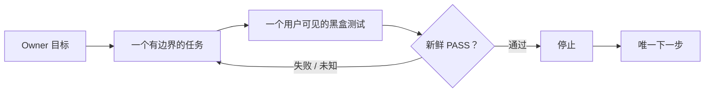

<p align="center">
  <a href="./README.md">English</a>
  ·
  <strong>简体中文</strong>
</p>

<h1 align="center">Oh No, Codex!</h1>

<p align="center">
  <strong>为 Codex vibe coding 打造的快速防漂移 Harness。</strong>
</p>

<p align="center">
  生于 Codex 的十八宗罪，用来阻止下一次失控。
</p>

<p align="center">
  <a href="./docs/PRODUCT-CONTRACT.md">
    
  </a>
  
  
  <a href="./LICENSE">
    
  </a>
</p>

<p align="center">
  <a href="#为什么需要-oh-no-codex">为什么</a>
  ·
  <a href="#四个闭环">四个闭环</a>
  ·
  <a href="#caliper-cockpit-驾驶舱">驾驶舱</a>
  ·
  <a href="#codex-十八宗罪">十八宗罪</a>
  ·
  <a href="#项目契约">文档</a>
</p>

> [!IMPORTANT]
> **V1 正在实现。** 产品合同已经冻结，但软件包尚未发布。本页中的命令和
> 驾驶舱画面目前属于合同预览，只有通过对应的公开验收后才会标记为可用。

## 为什么需要 Oh No, Codex？

Codex 可以写出不错的代码，同时仍然让整个项目逐渐漂移：

- 一个很小的需求，悄悄膨胀成一套新架构；
- 内部测试全绿，用户真正看到的功能却不能用；
- “下一步做什么”被误解成“已经获得继续开发的授权”；
- 需求已经变化，规范文档却没有同步；
- 新 Session 的第一个小时都浪费在从聊天记录里重建现场。

Oh No, Codex! 像一把卡在任务边界上的轻量游标卡尺。写代码之前，先冻结一个
有边界的任务和一个最小黑盒测试；到达终点时，由新鲜证据——而不是 Agent
自述——决定是否完成并停止。

它是一个**合作式项目 Harness**，不是 AI 安全沙箱，也不是企业治理平台。

## 最小合同



每个活动任务必须冻结：

- 用户最终能够看到的预期行为；
- 一个精确的最小黑盒命令；
- 允许修改的文件范围和时间预算；
- 明确的停止条件；
- 恰好一个建议的下一步。

测试失败或结果未知，任务继续保持活动状态。只有新鲜 PASS 才能关闭任务；
相关内容再次变化后，旧 PASS 自动失效。

## 四个闭环

| 闭环 | 防止什么 | Harness 做什么 |
| --- | --- | --- |
| **开始** | 没想清楚任务就开始写代码 | 冻结预期行为、测试、文件、预算、停止条件和唯一下一步。 |
| **完成** | “看起来做完了”冒充真实完成 | 运行精确黑盒测试，把 PASS 绑定到任务、HEAD 和允许文件摘要。 |
| **变更** | 需求和规范文档各走各的 | 从 Owner 维护的 Truth 中选择必要文档，展示精确 diff，审核前禁止继续编码。 |
| **恢复** | 新 Session 从聊天历史猜测现场 | 从同一个原子状态文件返回目标、当前任务、证据新鲜度、阻塞和唯一下一步。 |

## 三十秒工作流

> 下列接口是已经冻结的 V1 合同。软件包尚未发布时，它们不是安装或可用性声明。

```bash
# 1. 锚定项目目标
ohno init --goal "可靠保存用户草稿"

# 2. 开始一个有边界的任务
ohno task start \
  --id "draft-persistence" \
  --expect "用户保存的草稿在刷新页面后仍然存在" \
  --test "npm test -- draft-persistence" \
  --stop "该黑盒测试通过后立即停止" \
  --files "src/drafts/**,test/draft-persistence.test.*" \
  --minutes 60 \
  --next "增加草稿删除功能"

# 3. 让证据决定是否完成
ohno verify

# 4. 在新 Session 中恢复精确现场
ohno resume
ohno next
```

## 一个权威，多种视图

```text
Codex
  │
  ▼
ohno CLI ───── 原子替换 ─────▶ .ohno/state.json
  │                                │
  │                                ├── status / resume / next
  │                                ├── Codex 生命周期 hooks
  │                                ├── Git pre-commit
  │                                └── 只读 Cockpit
  │
  └──── 规范文档 ◀────────── .ohno/truth.json
```

- `.ohno/state.json` 是唯一当前运行时权威。
- `.ohno/truth.json` 是由 Owner 维护的规范文档适用清单。
- Hooks、终端输出、收据和驾驶舱都只是投影，不会成为第二份真相。
- 正常状态查询只读取有边界的小状态，不扫描整个仓库，也不运行全套测试。

## Caliper Cockpit 驾驶舱

驾驶舱采用**精密游标卡尺 + 警告信号灯**的独特视觉，而不是常见的 SaaS
后台模板。最大的仪表只回答两个问题：**现在正在做什么？唯一下一步是什么？**
较小的仪表负责显示测试证据是否新鲜、规范文档是否发生漂移。

> [!NOTE]
> **概念预览——UI 尚未实现。** 这里已经为正式产品画面预留位置。只有运行中的
> 驾驶舱通过浏览器视觉、响应式、无障碍和功能验收后，才会换成真实的桌面及
> 窄屏截图。

```text
┌─ OH NO / CALIPER COCKPIT ───────────────────── 本地 · 只读 ──────┐
│                                                                  │
│  现在 NOW                                                        │
│  DRAFT-PERSISTENCE                              进行中 · 42 分钟 │
│  用户保存的草稿在刷新页面后仍然存在                              │
│  ──────────────────────────────────────────────────────────────  │
│                                                                  │
│  证据 PROOF                    漂移 DRIFT                         │
│  ○ 未知                        ● 干净                             │
│  npm test -- draft-persistence  规范文档已经对齐                  │
│                                                                  │
│  下一步 NEXT                                                     │
│  运行精确的黑盒测试                                              │
│                                                                  │
└──────────────────────────────────────────────────────────────────┘
```

视觉合同采用温暖的仪器纸背景、近黑色文字；红色只表示阻塞或过期，琥珀色表示
任务进行中，克制的薄荷绿只表示新鲜 PASS。驾驶舱始终只读，不建立第二套状态。

## 轻量 Codex 与 Git 护栏

项目级 Codex hooks 只做快速、诚实的防漂移工作：

| Hook | 行为 |
| --- | --- |
| `SessionStart` | 注入有大小限制的现场恢复胶囊。 |
| `PostCompact` | 上下文压缩后重新注入当前权威状态。 |
| `PreToolUse` | 没有活动任务、文档待同步或明确越出文件范围时，阻止支持的写入路径。 |
| `Stop` | 显式完成标记缺少新鲜精确证据时，要求继续处理。 |
| Git `pre-commit` | 拒绝过期证明或活动任务范围外的暂存文件。 |

这些是合作式护栏。没有覆盖或可以绕过的路径会被如实写成限制，绝不会冒充
“恶意 Agent 无法突破”的安全边界。

## Codex 十八宗罪

产品把反复出现的失败模式变成可执行约束、公开验收或明确非目标。

<details>
<summary><strong>展开查看完整十八宗罪</strong></summary>

| # | 失败模式 | 产品约束 |
| ---: | --- | --- |
| 1 | **越俎代庖**——Agent 自己决定 Owner 的真实意思。 | 保留 Owner 原话；歧义不能静默扩大范围。 |
| 2 | **最大化解释**——一个小 Harness 被做成治理操作系统。 | 选择满足冻结验收的最小行为。 |
| 3 | **完成以后不停**——把下一步当成新授权。 | 验收结束当前任务；下一步只是信息，不是许可。 |
| 4 | **把审查当修改权。** | Review 默认只读，除非 Owner 明确授权修复。 |
| 5 | **旧权威复活**——旧计划覆盖当前决策。 | 当前原子状态高于摘要和历史计划。 |
| 6 | **用摘要改写真相。** | Resume 只投影原子状态，不能成为新权威。 |
| 7 | **局部绿灯冒充完成。** | 每个完成声明都必须写清精确证据范围。 |
| 8 | **同一 Agent 自证闭环。** | 精确命令和绑定对象的收据高于 Agent 自述。 |
| 9 | **测试戏剧**——内部通过但用户功能失败。 | 每个任务必须拥有一个用户可见的公开黑盒。 |
| 10 | **代理目标反客为主。** | 始终只保留一个 Owner 目标和一个有边界的活动任务。 |
| 11 | **Reviewer 扩大分母。** | 只按冻结验收审查；额外想法只能作为建议。 |
| 12 | **对控制税失明。** | 延迟和恢复胶囊大小本身就是验收指标。 |
| 13 | **重造整个世界。** | 没有当前已复现需求，就不增加抽象。 |
| 14 | **工作区身份混乱。** | 交接必须给出真实路径、分支、commit、tree 和 dirty 状态。 |
| 15 | **把交接税转嫁给用户。** | `resume` 一次返回紧凑、可操作的现场胶囊。 |
| 16 | **最后才还 UX 债。** | 驾驶舱先冻结设计，再编码，并通过真实浏览器验收。 |
| 17 | **附和与过度自信。** | 使用诚实的能力标签和真实测量证据。 |
| 18 | **道歉没有变成约束。** | 已确认失败必须变成可执行规则或回归测试。 |

完整双语记录见
[`docs/CODEX-SINS.md`](./docs/CODEX-SINS.md)。

</details>

## 刻意保持小

V1 有明确的复杂度上限：

- 一个 Node.js 包和一个 `ohno` 可执行文件；
- 一个原子当前状态文件和一个 Truth 适用清单；
- 一份项目级 Codex hook 配置和一个 Git hook；
- 一个本地只读驾驶舱；
- 不做数据库、daemon、托管服务、策略语言、插件平台、Provider 框架或
  多 Agent 调度器。

除非当前公开验收测试已经失败并证明需要，否则新抽象没有资格进入 V1。

## 用证据说话，不靠承诺

性能目标必须在三个一次性真实项目副本上实测：

| 表面 | V1 目标 |
| --- | ---: |
| `ohno status` / `ohno next` | 本地 p95 小于 250 ms |
| `ohno resume` | 本地 p95 小于 500 ms |
| 恢复胶囊 | 小于 4 KiB |
| 任务开始控制开销 | 小于 2 秒，不含用户测试 |
| 状态反映到驾驶舱 | 本地 p95 小于 250 ms |

试验通过以前，这些只是目标，不是对所有环境的绝对速度承诺。

## 项目契约

公开事实以这些文件为准：

1. [产品合同](./docs/PRODUCT-CONTRACT.md)
2. [V1 设计](./docs/DESIGN.md)
3. [验收合同](./docs/ACCEPTANCE.md)
4. [实施账本](./docs/IMPLEMENTATION-PLAN.md)
5. [Codex 十八宗罪](./docs/CODEX-SINS.md)

## License

[MIT](./LICENSE)

<p align="center">
  <strong>一个目标。一个任务。一个黑盒。通过，然后停止。</strong>
</p>
